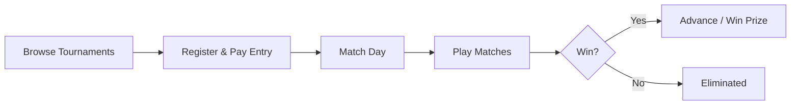

# Supported Games & Gameplay

FortisArena is a **multi-game competitive tournament platform**. We host tournaments across multiple game titles and genres — from FPS shooters to battle royales, MOBAs to sports sims.

<Note>
  FortisArena is **not a game itself** — it's a platform where players compete in existing popular game titles through organized tournaments with real prize pools.
</Note>

---

## Supported Games

### Currently Live

| Genre | Game | Team Size | Tournament Formats |
|:------|:-----|:----------|:-------------------|
| **Battle Royale** | PUBG | Solo / Duo / Squad | Elimination, Points-based |
| **Battle Royale** | Free Fire | Solo / Squad | Elimination, Points-based |
| **FPS** | CS2 (Counter-Strike 2) | 5v5 | Best-of-1, Best-of-3, Best-of-5 |
| **FPS** | Valorant | 5v5 | Best-of-1, Best-of-3 |

### Coming Soon

| Genre | Game | Team Size | Expected |
|:------|:-----|:----------|:---------|
| **MOBA** | Dota 2 | 5v5 | Q2 2026 |
| **MOBA** | League of Legends | 5v5 | Q2 2026 |
| **Sports** | EA FC (FIFA) | 1v1 / 2v2 | Q3 2026 |
| **Sports** | eFootball | 1v1 | Q3 2026 |

### Planned

| Genre | Game | Notes |
|:------|:-----|:------|
| **Fighting** | Tekken 8 | Community-requested |
| **Fighting** | Street Fighter 6 | Community-requested |
| **Strategy** | StarCraft II | Under evaluation |
| **Mobile** | PUBG Mobile | High demand in SEA/MENA regions |
| **Mobile** | Mobile Legends | Under evaluation |

<Info>
  Game list is expanding based on community demand and competitive viability. Join our [Discord](https://discord.gg/qTTYxTnK3s) to vote on which games to add next.
</Info>

---

## How Tournaments Work

### Tournament Flow



### Entry Requirements

| Requirement | Details |
|:------------|:--------|
| **Account** | FortisArena account required |
| **KYC** | Identity verification for prize-eligible tournaments |
| **Entry Fee** | Paid in FRT (varies by tournament tier) |
| **Game Account** | Your own game account linked to profile |
| **Anti-Cheat** | Must pass anti-cheat verification |

### Tournament Formats

| Format | How It Works | Best For |
|:-------|:-------------|:---------|
| **Single Elimination** | Lose once, you're out | Fast tournaments, large fields |
| **Double Elimination** | Winners + Losers bracket, two chances | Competitive events |
| **Swiss System** | Matched by similar win/loss record | Large player pools |
| **Round Robin** | Everyone plays everyone | League seasons |
| **Points-Based** | Score across multiple rounds (Battle Royale) | BR tournaments |

### Tournament Tiers

| Tier | Entry Fee Range | Prize Pool Range | Who Can Join |
|:-----|:----------------|:-----------------|:-------------|
| **Open** | Free - 10 FRT | 100 - 1,000 FPT | All verified players |
| **Amateur** | 10 - 50 FRT | 1,000 - 5,000 FRT | Amateur+ career level |
| **Semi-Pro** | 50 - 200 FRT | 5,000 - 25,000 FRT | Semi-Pro+ career level |
| **Pro** | 200 - 1,000 FRT | 25,000 - 100,000 FRT | Pro+ career level |
| **Elite** | Invite Only | 100,000+ FRT | Elite+ career level |
| **International** | Invite Only | 500,000+ FRT | Legend career level |

---

## Game Modes

### Competitive (Prize Pool)

These modes are part of organized tournaments with real stakes:

- **Bracket Tournaments** — Scheduled events with elimination rounds
- **League Matches** — Season-long competitions with standings
- **LAN Qualifiers** — Regional offline events for major tournaments
- **Pro Circuit** — Invitation-only professional tournaments

### Practice (No Stakes)

These modes help you improve without risking entry fees:

- **Quick Match** — Casual ranked practice against similarly skilled players
- **Scrims** — Practice matches between squads (arranged by teams)
- **Custom Lobbies** — Private matches for guild practice or community events

---

## Matchmaking

FortisArena uses **Skill-Based Matchmaking (SBMM)** for practice modes:

| Feature | How It Works |
|:--------|:-------------|
| **Skill Rating** | Based on win rate, K/D, and recent performance |
| **Fair Matching** | Paired with opponents of similar skill level |
| **Anti-Smurf** | Rapidly promotes highly skilled new accounts to correct tier |
| **Region Priority** | Matches players in same region for low latency |

<Note>
  Tournament matches use **bracket/seeding systems** instead of matchmaking — you play whoever you're matched against in the bracket.
</Note>

---

## Anti-Cheat & Fair Play

| Layer | What It Does |
|:------|:-------------|
| **KYC Verification** | One account per person — no smurfs in tournaments |
| **Device Fingerprinting** | Detects multi-accounting |
| **Match Review** | AI + human review for flagged matches |
| **Result Verification** | Game results cross-checked before prize distribution |
| **Dispute System** | Players can contest results with evidence |
| **On-Chain Results** | Final tournament results stored on blockchain for transparency |

---

## Prize Distribution

All prizes are distributed automatically to your FortisArena wallet:

- **Tournament Prizes** — FRT or FPT depending on tournament tier
- **Performance Bonuses** — MVP awards, top fragger bonuses
- **Seasonal Rewards** — End-of-season rankings rewards

### How Winnings Are Paid

```
Match Ends → Results Verified → Prize Auto-Deposited to Wallet
```

- Internal wallet — instant, no gas fees
- Withdraw to external wallet or bank whenever you want

---

## Getting Started

<Steps>
  <Step title="Create Account & Verify">
    Sign up on FortisArena and complete KYC verification
  </Step>

  <Step title="Link Your Game Account">
    Connect your game account (Steam, Riot, etc.) to your profile
  </Step>

  <Step title="Get FRT for Entry Fees">
    Buy or earn FRT tokens for tournament entry
  </Step>

  <Step title="Browse Tournaments">
    Find tournaments for your game and skill level
  </Step>

  <Step title="Register & Compete">
    Pay entry fee, show up on match day, and compete for prizes
  </Step>
</Steps>

---

## Next Steps

<CardGroup cols={2}>
  <Card title="Tournament Hub" icon="trophy" href="/tournaments/overview">
    Full tournament ecosystem guide
  </Card>
  <Card title="Squad Up" icon="users" href="/tournaments/squads">
    Find teammates and form a team
  </Card>
  <Card title="Buy FRT" icon="coins" href="/getting-started/buying-frt">
    Get tokens for tournament entry
  </Card>
  <Card title="Career Progression" icon="chart-line" href="/tournaments/overview#career-progression-system">
    Climb from Amateur to Legend
  </Card>
</CardGroup>

---

> **Your game. Your skill. Real prizes. — That's FortisArena.**
