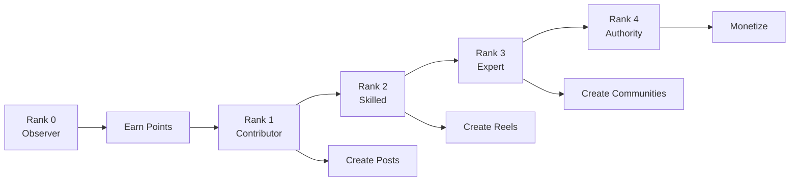

# Getting Started with FortisArena

## What is FortisArena?

FortisArena is a **gamified social platform** combined with a **professional eSports tournament hub**. Unlike traditional social media, we reward quality content and meaningful engagement through a sophisticated rank-based system.

### The Problem We Solve

**Traditional Social Media:**
- Rewards clickbait and controversy
- Anyone can post low-quality content
- Fake engagement and bots thrive
- Creators burn out chasing algorithms
- No real ownership of audience

**FortisArena Solution:**
- Quality scoring system elevates valuable content
- Rank-based access controls platform features
- Anti-bot protection ensures genuine engagement
- Sustainable creator economy
- Users own their reputation and can monetize

## 🎮 Platform Components

### 1. Social Platform (Gamified)

A reputation-based social network where **your rank unlocks features**:

**Key Features:**
- **Posts** (Rank 1+) - Text, images, long-form content
- **Reels** (Rank 2+) - Short-form video content
- **Communities** (Rank 3+) - Interest-based groups
- **Feed** - Algorithm-curated quality content
- **DM System** - Direct messaging between users

### 2. Tournament Hub (eSports)

A professional competitive gaming ecosystem for verified users:

- **Multiple game titles** (PUBG, CS:GO, Dota 2, etc.)
- **Various formats** (Single elimination, double elimination, battle royale)
- **Skill-based matchmaking**
- **Automated prize distribution**
- **Career progression tracking**

**Access:** Tournament participation requires **Rank 2+** (verified quality users only).

## 🏆 The Rank System

FortisArena uses a **5-tier rank system** that unlocks platform features:

| Rank | Name | Points | Key Unlock |
|:-----|:-----|:-------|:-----------|
| **0** | Observer | 0-100 | View content, learn culture |
| **1** | Contributor | 100-500 | **Create posts** |
| **2** | Skilled Member | 500-2,000 | **Create reels** + Tournament access |
| **3** | Expert | 2,000-7,000 | **Create communities** |
| **4** | Authority | 7,000+ | **Revenue share** + Governance |

### How to Progress

<Steps>
  <Step title="Rank 0: Learn">
    Browse content, understand quality standards
    Earn points through engagement (likes, comments, saves)
  </Step>
  
  <Step title="Rank 1: Create">
    Unlock ability to create posts
    Focus on high-quality written content
  </Step>
  
  <Step title="Rank 2: Multimedia">
    Unlock video reels
    Join tournament competitions
    Access private communities
  </Step>
  
  <Step title="Rank 3: Lead">
    Create your own communities
    Moderate discussions
    Tag content as "Verified Knowledge"
  </Step>

  <Step title="Rank 4: Master">
    Revenue sharing from platform
    Governance voting rights
    Verified community creation
  </Step>
</Steps>

## 💰 Points & Rewards

### Earning Points

Points are earned through **quality contributions** and **meaningful engagement**:

| Action | Points | Description |
|:-------|:-------|:------------|
| High-effort post | +30 | QS ≥ 80, approved by system |
| Average post | +10 | QS 50-79, meets guidelines |
| Meaningful comment | +5 | 20+ characters, thoughtful |
| Save/bookmark | +4 | Content saved by others |
| Share with caption | +6 | Thoughtful distribution |
| Knowledge Boost | ×2 | Validated by 3+ Experts |

### Content Categories

Different content types earn different point weights:

| Category | Weight | Examples |
|:---------|:-------|:---------|
| 🎮 Gaming | 4× | Strategy guides, esports analysis |
| 📚 Knowledge | 5× | Educational posts, research |
| 💰 Finance/Web3 | 5× | Trading education, guides |
| 🧪 Tutorials | 5× | Step-by-step learning |
| 😂 Fun | 2× | Quality memes (limited) |

<Warning>
  **Not Allowed:** Daily vlogs, personal drama, reaction-only content, reposted content. Low-effort posts receive 0 points or penalties.
</Warning>

### Seasonal Reset

Every **3 months (quarterly):**

- Points partially reset (30% above rank minimum)
- Ranks preserved if activity maintained
- New leaderboard opportunities
- Prevents old accounts from dominating forever

## 🎯 Content Quality System

### Quality Score (QS)

Every post receives a Quality Score (0-100) based on:

| Factor | Weight | Description |
|:-------|:-------|:------------|
| Content Type | 40% | Category alignment |
| Originality | 25% | Uniqueness detection |
| Effort Signals | 20% | Length, structure, media |
| Community Feedback | 15% | Reports, validation |

### Proof-of-Effort

Before publishing, content is analyzed:

1. **Originality Check** - Duplicate detection
2. **Category Verification** - AI classification
3. **Effort Analysis** - Minimum requirements
4. **Spam Detection** - Bot behavior patterns

<Note>
  Low-effort content is rejected **before** publishing, protecting creators from penalties.
</Note>

## 🎮 Tournament System

### Who Can Participate

| Tournament Type | Minimum Rank | Description |
|:----------------|:-------------|:------------|
| Social Events | Rank 0 | Casual, fun competitions |
| Casual | Rank 1 | Entry-level tournaments |
| Competitive | Rank 2+ | Serious competition |
| Premium | Rank 3+ | High prize pools |
| VIP Invitationals | Rank 4 | Exclusive events |

### Tournament Formats

- **Single Elimination** - Fast, high stakes
- **Double Elimination** - Second chance bracket
- **Round Robin** - Everyone plays everyone
- **Swiss System** - Skill-based pairing
- **Battle Royale** - Last standing wins

### Prizes

- **FRT** - Access token (tournament entry, staking)
- **FPT** - Rewards token (tournament prizes, tips)
- **NFT Badges** - Achievement collectibles
- **Merchandise** - Physical rewards
- **Cash** (stablecoins) - For major events

## 🛡️ Security & Trust

### Platform Security

- **Internal Wallet System** - Platform-provided, secure custody
- **Anti-Cheat** - Kernel-level detection for tournaments
- **Bot Protection** - AI-powered fake engagement detection
- **Content Moderation** - Community + AI hybrid
- **Privacy First** - User data protection

### User Protection

- Two-factor authentication (2FA)
- Account recovery options
- Suspicious activity alerts
- Report and appeal systems
- Transparent moderation

## 📱 Getting Started

### Step 1: Create Account

<Steps>
  <Step title="Sign Up">
    Visit [app.fortisarena.io](https://app.fortisarena.io)
    Sign up with email or phone
  </Step>
  
  <Step title="Verify Identity">
    Confirm email/phone
    Complete basic profile
  </Step>
  
  <Step title="Wallet Created">
    Platform automatically creates your wallet
    No seed phrases needed - secured with MPC technology
  </Step>
  
  <Step title="Start as Rank 0">
    Begin as Observer
    Learn platform culture
  </Step>
</Steps>

### Step 2: Earn Your First 100 Points

To reach Rank 1 (Contributor):

- Like 20 quality posts (+20 points)
- Write 10 meaningful comments (+50 points)
- Save valuable content (+20 points)
- Share with thoughtful captions (+10 points)

**Timeline:** 3-7 days of active engagement

### Step 3: Start Creating (Rank 1)

Once you reach Rank 1:

- Create your first post
- Choose content category wisely
- Focus on gaming, knowledge, or tutorials
- Engage with commenters

### Step 4: Progress Through Ranks

Continue creating quality content:
- **Rank 2** - Unlock reels and tournaments
- **Rank 3** - Create communities
- **Rank 4** - Revenue share and governance

## 🌟 Success Tips

### For New Users (Rank 0-1)

- Study top creators in your niche
- Engage meaningfully before posting
- Learn what content gets "Knowledge Boosts"
- Build consistent habits

### For Creators (Rank 2-3)

- Mix posts and reels for maximum reach
- Build expertise in specific categories
- Collaborate with other creators
- Create series/content pillars

### For Leaders (Rank 4)

- Mentor lower-ranked users
- Build and nurture communities
- Participate in platform governance
- Establish thought leadership

## 🚫 Common Mistakes to Avoid

1. **Posting before understanding culture** - Spend time as Rank 0 first
2. **Low-effort content** - Results in penalties, not points
3. **Wrong category** - Gaming content in Finance = penalty
4. **Buying engagement** - Bot detection will catch and ban
5. **Ignoring feedback** - Community reports affect your rank

## 📚 Learn More

<CardGroup cols={2}>
  <Card title="Rank System Deep Dive" icon="trophy" href="/platform/social-gamification">
    Complete guide to points, ranks, and progression
  </Card>
  <Card title="Rank Quick Reference" icon="book-open" href="/platform/rank-quick-reference">
    Quick lookup for rank features and requirements
  </Card>
  <Card title="Tournament Guide" icon="gamepad" href="/tournaments/getting-started">
    How to compete and win
  </Card>
  <Card title="Content Guidelines" icon="shield" href="/platform/social-gamification">
    What to post and what to avoid
  </Card>
</CardGroup>

## 🤝 Community & Support

- **Discord:** [discord.gg/qTTYxTnK3s](https://discord.gg/qTTYxTnK3s)
- **Twitter:** [@fortisarena](https://x.com/fortisarena)
- **Email:** support@fortisarena.io
- **Help Center:** Browse documentation

## 🎯 Ready to Start?

1. **[Create Account](https://app.fortisarena.io)** - Sign up and get started
2. **[Learn Rank System](/platform/social-gamification)** - Understand the progression
3. **[Browse Content](/platform/social-gamification)** - See what quality looks like

<Note>
  Quality over quantity. FortisArena rewards those who contribute genuine value to the community. Take your time, learn the culture, and build something meaningful.
</Note>

---

> **FortisArena** - Where Knowledge Meets Skill, and Skill Meets Reward.
