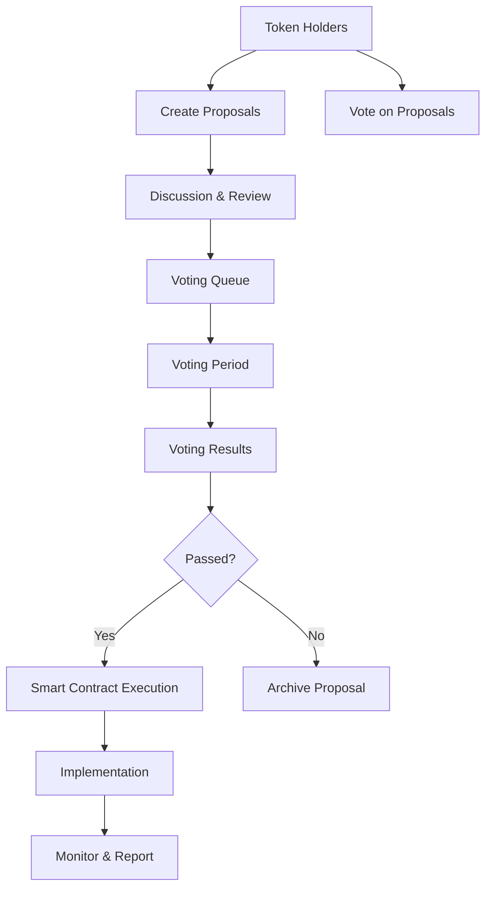

# DAO Governance

FortisArena operates as a Decentralized Autonomous Organization (DAO), giving FRT token holders direct control over platform development, treasury management, and ecosystem decisions.

## What is the FortisArena DAO?

The DAO is a governance system where:

- **Token holders propose** changes to the platform
- **Community votes** on proposals using FRT tokens
- **Smart contracts execute** approved decisions automatically
- **Treasury funds** are allocated through transparent voting



## Governance Principles

### 1. Transparency

All governance actions are public:
- Proposal details on-chain
- Voting records verifiable
- Treasury movements tracked
- Execution automated

### 2. Inclusivity

Anyone with FRT can participate:
- No minimum voting amount
- Delegation allowed
- Multiple proposal types
- Educational resources provided

### 3. Security

Multiple safeguards protect the DAO:
- Time delays for major changes
- Multi-signature requirements
- Emergency pause functionality
- Regular security audits

## Voting Power

### How Voting Power is Calculated

Your voting power depends on:

| Factor | Weight | Description |
|:-------|:-------|:------------|
| **FRT Holdings** | Base | 1 FRT = 1 vote base |
| **Staking Multiplier** | ×1.0 to ×2.0 | Longer stake = more voting power |
| **Participation Bonus** | +5-10% | Regular voters earn bonus |
| **Delegation** | Full | Receive votes from others |

### Voting Power Examples

| Scenario | FRT Held | Stake Duration | Voting Power |
|:---------|:---------|:---------------|:-------------|
| New holder | 10,000 | Flexible | 10,000 |
| Silver staker | 10,000 | 90 days | 12,500 |
| Platinum staker | 10,000 | 365 days | 20,000 |
| Active participant | 10,000 | 365 days + bonus | 22,000 |

## Types of Proposals

### Community Proposal

| Parameter | Value |
|:----------|:------|
| **Threshold** | 100 FRT to create |
| **Voting Period** | 3 days |
| **Quorum** | 1% of circulating supply |
| **Approval** | Simple majority (>50%) |
| **Execution** | Advisory only |

**Use Cases:**
- Feature requests
- Community initiatives
- Process improvements
- Partner recommendations

### Standard Proposal

| Parameter | Value |
|:----------|:------|
| **Threshold** | 1,000 FRT to create |
| **Voting Period** | 5 days |
| **Quorum** | 3% of circulating supply |
| **Approval** | 60% supermajority |
| **Execution** | Automatic if passed |

**Use Cases:**
- Tournament rule changes
- Platform parameter updates
- New game integrations
- Fee adjustments

### Treasury Proposal

| Parameter | Value |
|:----------|:------|
| **Threshold** | 10,000 FRT to create |
| **Voting Period** | 7 days |
| **Quorum** | 5% of circulating supply |
| **Approval** | 66% supermajority |
| **Execution** | Multi-sig + timelock |

**Use Cases:**
- Funding development
- Marketing campaigns
- Partnership investments
- Grant programs

### Constitutional Proposal

| Parameter | Value |
|:----------|:------|
| **Threshold** | 100,000 FRT to create |
| **Voting Period** | 14 days |
| **Quorum** | 10% of circulating supply |
| **Approval** | 75% supermajority |
| **Execution** | 7-day timelock + review |

**Use Cases:**
- Governance structure changes
- Tokenomics modifications
- Treasury policy updates
- Platform mission changes

## How to Create a Proposal

### Step-by-Step Process

<Steps>
  <Step title="Draft Your Proposal">
    Write a clear proposal following the template including:
    - Title and summary
    - Motivation
    - Detailed specification
    - Expected impact
    - Timeline
  </Step>
  
  <Step title="Community Discussion">
    Post in the Forum for at least 3 days to gather feedback
  </Step>
  
  <Step title="Refine Based on Feedback">
    Update proposal addressing community concerns
  </Step>
  
  <Step title="Formal Submission">
    Connect wallet and submit via governance portal
  </Step>
  
  <Step title="Pay Deposit">
    FRT deposit required (returned if quorum reached)
  </Step>
  
  <Step title="Voting Begins">
    After review period, voting opens automatically
  </Step>
</Steps>

### Proposal Template

```markdown
# Proposal Title

## Summary
One-paragraph overview

## Motivation
Why is this needed?

## Specification
Detailed technical requirements

## Implementation
How will this be executed?

## Budget
If applicable, funding requirements

## Timeline
Key milestones

## Risks
Potential downsides and mitigations
```

## How to Vote

### Voting Process

<Steps>
  <Step title="Access Governance Portal">
    Visit [gov.fortisarena.io](https://gov.fortisarena.io)
  </Step>
  
  <Step title="Connect Wallet">
    Connect the wallet holding your FRT tokens
  </Step>
  
  <Step title="Browse Proposals">
    View active proposals and their details
  </Step>
  
  <Step title="Review">
    Read full proposal and community discussion
  </Step>
  
  <Step title="Cast Vote">
    Choose: For, Against, or Abstain
  </Step>
  
  <Step title="Confirm">
    Sign transaction (no gas fees for voting)
  </Step>
</Steps>

### Vote Options

| Option | Meaning |
|:-------|:--------|
| **For** | Support the proposal |
| **Against** | Oppose the proposal |
| **Abstain** | Neutral, counts toward quorum only |

### Changing Your Vote

You can change your vote at any time during the voting period. Simply cast a new vote to override your previous choice.

## Delegation

### What is Delegation?

If you don't have time to research proposals, delegate your voting power to someone you trust.

### How to Delegate

1. Visit the Delegation page
2. Enter delegate's wallet address (or pick from list)
3. Specify delegation scope (all votes or specific types)
4. Confirm delegation
5. Can be revoked anytime

### Delegation Options

| Type | Description |
|:-----|:------------|
| **Full Delegation** | Delegate votes on all proposals |
| **Category-Specific** | Only delegate certain proposal types |
| **Time-Bound** | Delegation expires after set period |

### Popular Delegates

| Delegate | Expertise | Voting Record |
|:---------|:----------|:--------------|
| GameDev_Team | Development | 98% participation |
| Esports_Pro | Tournaments | 95% participation |
| Tokenomics_Lab | Economics | 100% participation |

## Treasury Management

### Treasury Overview

The DAO treasury holds:
- FRT tokens for development
- Stablecoins for operations
- NFT assets for partnerships
- LP tokens for protocol-owned liquidity

### Current Treasury

| Asset | Amount | Value (USD) |
|:------|:-------|:------------|
| FRT | 15,000,000 | $1,500,000 |
| USDT | 500,000 | $500,000 |
| BNB | 1,000 | $250,000 |
| LP Tokens | Various | $300,000 |
| **Total** | | **$2,550,000** |

### Expenditure Categories

| Category | Budget % | Description |
|:---------|:---------|:------------|
| Development | 40% | Core platform development |
| Marketing | 20% | Growth and awareness |
| Community | 15% | Events and incentives |
| Operations | 15% | Team and infrastructure |
| Reserve | 10% | Emergency fund |

### Spending Limits

| Proposal Type | Max Amount | Approval Required |
|:--------------|:-----------|:------------------|
| Standard | 50,000 FRT | 60% vote |
| Treasury | 500,000 FRT | 66% vote |
| Constitutional | Unlimited | 75% vote + timelock |

## Governance History

### Notable Past Proposals

| Proposal | Result | Impact |
|:---------|:-------|:-------|
| P-001: Launch Tournament System | Passed 89% | Enabled core platform feature |
| P-012: Add CS:GO Support | Passed 76% | Expanded game portfolio |
| P-023: Reduce Marketplace Fees | Passed 82% | 2.5% → 2.0% fees |
| P-031: Staking Tiers Expansion | Passed 71% | New utility staking tiers added |
| P-045: Partnership with Game Studio | Rejected 42% | Did not reach threshold |

### Participation Statistics

| Metric | Value |
|:-------|:------|
| Total Proposals | 47 |
| Passed Proposals | 38 (81%) |
| Average Voter Turnout | 12% |
| Average Voting Power | 2.3M FRT |
| Delegation Rate | 28% |

## Voting Incentives

### Participation Rewards

Active voters receive:
- FPT token rewards
- "Active Citizen" NFT badge
- Increased voting power multiplier
- Early access to new features

### Reward Calculation

```
Monthly Reward = Base + (Participation Rate × Bonus)

Base: 100 FPT
Bonus: Up to 200 FPT for 100% participation
```

## Governance Roadmap

### Phase 1: Current (Q1 2026)
- ✅ Basic proposal system
- ✅ Voting with FRT
- ✅ Treasury transparency
- 🔄 Delegation system

### Phase 2: Enhancement (Q2 2026)
- Delegation marketplace
- Expert council formation
- Governance forums upgrade
- Mobile voting app

### Phase 3: Maturity (Q3-Q4 2026)
- Quadratic voting experiments
- Sub-DAOs for specific domains
- Automated proposal execution
- Cross-chain governance

## Best Practices

### For Proposers

<Check>
  - [ ] Research thoroughly before proposing
  - [ ] Engage community in pre-proposal discussion
  - [ ] Provide clear, specific details
  - [ ] Consider potential risks
  - [ ] Be responsive to feedback
  - [ ] Follow proposal template
</Check>

### For Voters

<Check>
  - [ ] Read full proposal before voting
  - [ ] Consider long-term impact
  - [ ] Review discussion thread
  - [ ] Vote consistently with your values
  - [ ] If unsure, abstain or delegate
</Check>

## Governance Resources

<CardGroup cols={2}>
  <Card title="Governance Portal" icon="landmark" href="https://gov.fortisarena.io">
    Submit and vote on proposals
  </Card>
  <Card title="Forum" icon="message-square" href="https://forum.fortisarena.io">
    Discuss proposals before voting
  </Card>
  <Card title="Treasury Dashboard" icon="pie-chart" href="https://treasury.fortisarena.io">
    Track DAO funds in real-time
  </Card>
  <Card title="Voting History" icon="history" href="https://gov.fortisarena.io/history">
    Review past proposals and votes
  </Card>
</CardGroup>

## Frequently Asked Questions

### Do I need to pay gas to vote?

No, voting is gasless through signature-based authentication.

### Can I vote with staked FRT?

Yes, staked FRT counts toward your voting power and may receive multipliers.

### What happens if quorum isn't reached?

The proposal fails and the deposit is returned to the proposer.

### How long until approved proposals take effect?

- Standard: 2 days after voting ends
- Treasury: 5 days after voting ends
- Constitutional: 7 days after voting ends

### Can the core team override governance decisions?

No, the core team cannot override passed proposals. Emergency powers exist only for critical security issues.

## Getting Involved

Ready to participate in FortisArena governance?

1. **Acquire FRT** - [Buy on exchanges](/getting-started/buying-frt)
2. **Stake Your Tokens** - [Maximize voting power](/tokenomics/staking)
3. **Join Discussions** - [Participate in Forum](https://forum.fortisarena.io)
4. **Vote Regularly** - [Governance Portal](https://gov.fortisarena.io)

<Note>
  Governance is a responsibility. Take time to understand proposals before voting. The future of FortisArena is in the hands of token holders.
</Note>
