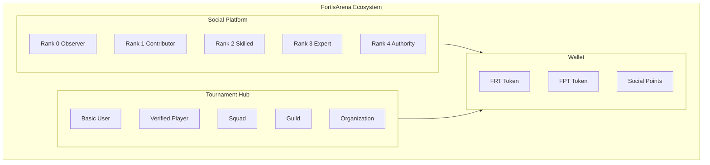

# Welcome to FortisArena

## Two Platforms, One Ecosystem

FortisArena is a **dual-platform ecosystem** combining a **gamified social network** with a **professional esports tournament hub**. Both platforms share a unified wallet system but serve different purposes.



---

## 🎨 Platform 1: Social (Gamified)

A **reputation-based social network** where quality content unlocks features and ranks.

### The Philosophy

> **"Low-effort noise out, high-effort knowledge + skill in."**

Unlike traditional social media that rewards clickbait, we reward:
- **Knowledge sharing** (tutorials, guides)
- **Gaming skill** (strategy, analysis)
- **Educational content** (finance, learning)
- **Community value** (helping others)

### Rank System (0-4)

Progress by earning points through quality contributions:

| Rank | Name | Points | Key Unlock |
|:-----|:-----|:-------|:-----------|
| **0** | Observer | 0-100 | View & learn |
| **1** | Contributor | 100-500 | **Create posts** |
| **2** | Skilled | 500-2,000 | **Create reels** |
| **3** | Expert | 2,000-7,000 | **Create communities** |
| **4** | Authority | 7,000+ | **Revenue share** |

<CardGroup cols={2}>
  <Card title="Rank System Guide" icon="trophy" href="/platform/social-gamification">
    Full points, ranks, and progression details
  </Card>
  <Card title="Quick Reference" icon="book-open" href="/platform/rank-quick-reference">
    Fast lookup for rank features
  </Card>
</CardGroup>

---

## 🎮 Platform 2: Tournament Hub

A **professional esports ecosystem** for competitive gaming with real prizes.

### The Journey

> **"Viewer → Player → Squad → Guild → Organization → International"**

### User Types

| Type | Requirements | Can Do |
|:-----|:-------------|:-------|
| **Basic User** | Just signup | Watch matches, predict winners |
| **Verified Player** | KYC required | Compete, earn prizes, join squads |
| **Organization** | Verified entity | Host tournaments, run leagues |

### Career Progression

```
Amateur → Semi-Pro → Pro → Elite → Legend
```

Based on: Matches played, win rate, tournament tier, opponent level

<CardGroup cols={2}>
  <Card title="Tournament Hub Overview" icon="gamepad" href="/tournaments/overview">
    Complete esports ecosystem guide
  </Card>
  <Card title="Get Verified" icon="shield-check" href="/tournaments/verification">
    Start your competitive career
  </Card>
</CardGroup>

---

## 💰 Wallet (No External Wallet Needed!)

Both platforms connect to FortisArena's **internal wallet**—no MetaMask, Trust Wallet, or any external apps needed.

### How It Works

- ✅ **Platform provides wallet** - Auto-created on signup
- ✅ **No seed phrases to manage** - Secure MPC technology
- ✅ **Free internal transfers** - Send to other users instantly
- ✅ **Optional withdrawal** - Export to external wallets when needed

### Assets

| Asset | Used For | Earned From |
|:------|:---------|:------------|
| **Social Points** | Rank progression | Quality content, engagement |
| **FPT** | Tournaments, tips | Tournament wins, creator rewards |
| **FRT** | Staking, governance, premium | Tournament prizes, staking, Rank 4 revenue |

<CardGroup cols={2}>
  <Card title="Wallet Guide" icon="wallet" href="/platform/wallet-system">
    How internal wallet works
  </Card>
  <Card title="Staking" icon="lock" href="/tokenomics/staking">
    Unlock platform features
  </Card>
</CardGroup>

---

## 🚀 Getting Started

### New Users: Start Here

<Steps>
  <Step title="Create Account (30 Seconds)">
    Sign up with **Email, Google, Apple, or Phone**
    
    ✅ Wallet auto-created - **No MetaMask needed!**
    ✅ Email verification for basic access
    ✅ KYC only for competitive features
  </Step>
  
  <Step title="Choose Your Path">
    **Social Only:** Start earning points immediately (Email verified)
    **Competitive:** Complete KYC to unlock tournaments
  </Step>
  
  <Step title="Social Platform (Optional)">
    - Browse quality content
    - Earn 100 points to unlock posting
    - Build reputation through ranks
  </Step>
  
  <Step title="Tournament Hub (Optional)">
    - Complete verification
    - Join or create a squad
    - Compete for prizes
  </Step>
  
  <Step title="Both Platforms (Recommended)">
    Many users participate in both:
    - Content creators who compete
    - Pro players who share knowledge
    - Same wallet works for both platforms
    - Maximum earning potential
  </Step>
</Steps>

---

## 📊 Platform Comparison

| Feature | Social Platform | Tournament Hub |
|:--------|:----------------|:---------------|
| **Access** | Rank-based (0-4) | Verification-based |
| **KYC** | Not required | Required for competing |
| **Focus** | Content creation | Competitive gaming |
| **Progression** | Points → Ranks | Career Levels |
| **Earnings** | Points, revenue share | Tournament prizes |
| **Wallet** | Internal (platform) | Internal (platform) |
| **Best For** | Creators, educators | Competitors, pros |

---

## 🎯 Content That Thrives

### Social Platform (Quality Score System)

| Category | Weight | Examples |
|:---------|:-------|:---------|
| 🎮 Gaming | 4× | Strategy guides, esports analysis |
| 📚 Knowledge | 5× | Tutorials, educational content |
| 💰 Finance/Web3 | 5× | Trading education, market analysis |
| 🧪 Tutorials | 5× | Step-by-step skill building |
| 😂 Fun | 2× | Quality memes (limited) |

<Warning>
  **Not Allowed:** Daily vlogs, personal drama, reaction-only content, reposts
</Warning>

### Tournament Hub

- **Quick Matches** - Casual practice
- **Online Tournaments** - Weekly competitions
- **LAN Qualifiers** - Regional offline events
- **Pro Circuit** - Invitation-only elite
- **International** - Global championships

---

## 🛡️ Security & Trust

- **Internal Wallet** - MPC technology, no seed phrase stress
- **KYC Verification** - For competitive integrity
- **Anti-Cheat** - Kernel-level detection
- **Blockchain Finality** - Results stored on-chain
- **Data Privacy** - Encrypted, GDPR compliant

---

## 📚 Documentation

<CardGroup cols={2}>
  <Card title="Getting Started" icon="rocket" href="/getting-started/overview">
    Platform basics and first steps
  </Card>
  <Card title="Social Platform" icon="users" href="/platform/social-gamification">
    Rank system and content guide
  </Card>
  <Card title="Tournament Hub" icon="trophy" href="/tournaments/overview">
    Competitive gaming ecosystem
  </Card>
  <Card title="Wallet System" icon="wallet" href="/platform/wallet-system">
    Internal wallet and assets
  </Card>
  <Card title="Squads" icon="shield" href="/tournaments/squads">
    Create and manage teams
  </Card>
  <Card title="Guilds" icon="home" href="/tournaments/guilds">
    Build esports organizations
  </Card>
  <Card title="Staking" icon="lock" href="/tokenomics/staking">
    Unlock platform features
  </Card>
  <Card title="FAQ" icon="help-circle" href="/faq/general">
    Common questions answered
  </Card>
</CardGroup>

---

## 🤝 Community

- **Discord:** [discord.gg/qTTYxTnK3s](https://discord.gg/qTTYxTnK3s)
- **Twitter:** [@fortisarena](https://x.com/fortisarena)
- **Email:** support@fortisarena.io

---

> **FortisArena** - Where Knowledge Meets Skill on Social, and Skill Meets Reward in Competition.
