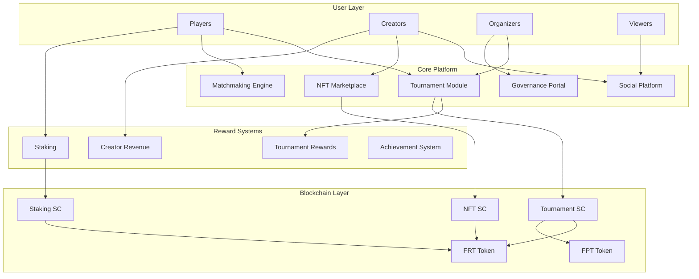
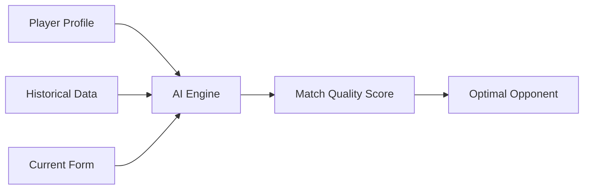
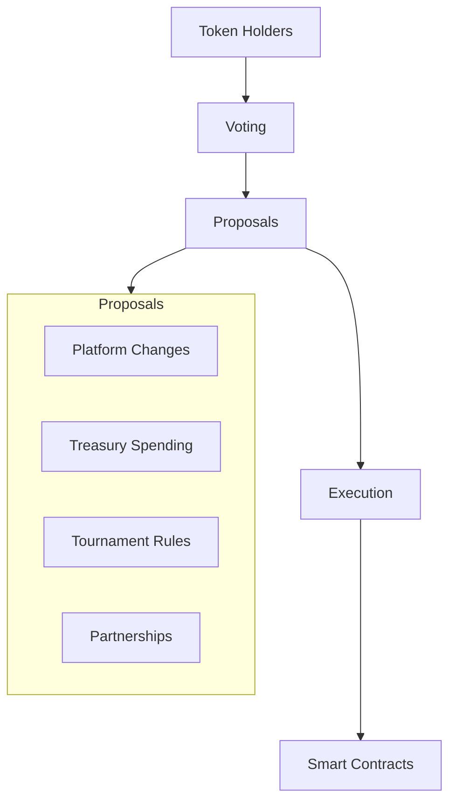

# Platform Overview

FortisArena is a comprehensive Web3 gaming ecosystem designed to revolutionize competitive gaming through blockchain technology. This guide covers all major platform features.

## Platform Architecture

## Tournament System

The heart of FortisArena is its sophisticated tournament engine.

### Tournament Types

| Type | Description | Entry Fee | Prize Pool |
|:-----|:------------|:----------|:-----------|
| **Free Tournaments** | Open to all players | Free | FPT rewards |
| **Paid Tournaments** | Competitive entry | 10-1000 FRT | FRT + FPT |
| **Sponsored Events** | Brand partnerships | Varies | Large prizes |
| **Qualifier Rounds** | Path to championships | Low | Progression |
| **Private Tournaments** | Invite-only | Custom | Custom |

### Tournament Formats

<AccordionGroup>
  <Accordion icon="users" title="Single Elimination">
    - Players compete in head-to-head matches
    - Loser eliminated after one defeat
    - Fastest format, good for large fields
    - Best of 1 or Best of 3 matches
  </Accordion>
  
  <Accordion icon="rotate-ccw" title="Double Elimination">
    - Two brackets: Winners and Losers
    - One loss moves to losers bracket
    - Second elimination removes player
    - More forgiving, popular for finals
  </Accordion>
  
  <Accordion icon="grid" title="Round Robin">
    - Each player faces all others
    - Points awarded for wins/draws
    - Top performers advance
    - Fair but time-intensive
  </Accordion>
  
  <Accordion icon="trophy" title="Swiss System">
    - Popular in chess/esports
    - Players paired with similar records
    - Fixed number of rounds
    - Efficient for large tournaments
  </Accordion>
  
  <Accordion icon="zap" title="Battle Royale">
    - Multiple players in single match
    - Last player/team standing wins
    - Points for eliminations and placement
    - Popular for FPS and survival games
  </Accordion>
</AccordionGroup>

### Prize Distribution

Prize pools are distributed automatically via smart contracts:

| Placement | Standard Distribution | Premium Distribution |
|:----------|:----------------------|:---------------------|
| 1st Place | 40% | 35% |
| 2nd Place | 25% | 22% |
| 3rd Place | 15% | 15% |
| 4th Place | 8% | 10% |
| 5th-8th | 3% each | 4.5% each |
| Participation | FPT bonuses | FPT bonuses |

<Info>
  Prize distribution is customizable by tournament organizers. Premium tournaments may include additional rewards like NFTs and exclusive badges.
</Info>

## AI Matchmaking System

### How It Works

Our proprietary AI analyzes multiple factors for optimal pairing:

### Matchmaking Factors

| Factor | Weight | Description |
|:-------|:-------|:------------|
| **Skill Rating** | 40% | ELO-based performance metric |
| **Win/Loss Ratio** | 20% | Historical success rate |
| **Recent Form** | 15% | Last 20 matches performance |
| **Play Style** | 10% | Aggressive vs Defensive tendencies |
| **Connection Quality** | 10% | Latency and stability |
| **Time Played** | 5% | Experience factor |

### Skill Tiers

Players are categorized into tiers for balanced competition:

| Tier | Skill Rating | Description |
|:-----|:-------------|:------------|
| **Bronze** | 0-999 | New players, learning fundamentals |
| **Silver** | 1000-1499 | Developing skills, casual competitive |
| **Gold** | 1500-1999 | Solid players, regular competitors |
| **Platinum** | 2000-2499 | Advanced players, tournament regulars |
| **Diamond** | 2500-2999 | Elite players, professional potential |
| **Master** | 3000-3499 | Top percentile, recognized talent |
| **Grandmaster** | 3500+ | Best of the best, invited to premier events |

## NFT Marketplace

### Types of NFTs

<CardGroup cols={2}>
  <Card title="Gaming Skins" icon="palette">
    Visual customizations for characters and weapons
  </Card>
  <Card title="Tournament Tickets" icon="ticket">
    Exclusive access to premium events
  </Card>
  <Card title="Achievement Badges" icon="award">
    Proof of accomplishments and milestones
  </Card>
  <Card title="Creator Collectibles" icon="video">
    Limited edition content from top creators
  </Card>
  <Card title="Virtual Real Estate" icon="home">
    Custom lobbies and virtual spaces
  </Card>
  <Card title="Utility NFTs" icon="key">
    Staking boosts, fee discounts, special access
  </Card>
</CardGroup>

### Marketplace Features

| Feature | Description |
|:--------|:------------|
| **Fixed Price** | Buy instantly at listed price |
| **Auctions** | Bid on rare items, highest bidder wins |
| **Bundles** | Purchase multiple NFTs together |
| **Offers** | Make private offers to sellers |
| **Royalties** | Creators earn 5% on secondary sales |
| **Verification** | Blue check for verified collections |

### Trading Fees

| Action | Fee |
|:-------|:----|
| Listing | Free |
| Sale | 2.5% platform fee |
| Royalty | 5% to creator |
| Gas | Network dependent |

## Social Platform

### Features

**Player Profiles**
- Customizable avatars and banners
- Achievement showcases
- Match history and statistics
- Trophy cabinets

**Content Feed**
- Share gameplay highlights
- Post updates and strategies
- Follow favorite players
- Comment and react

**Communities**
- Game-specific channels
- Tournament watch parties
- Strategy discussions
- Team recruitment

**Messaging**
- Direct messages
- Group chats
- Team communications
- Tournament coordination

### Creator Economy

Creators can monetize through:

| Revenue Stream | Description | Earnings |
|:---------------|:------------|:---------|
| **Subscriptions** | Fans subscribe monthly | 70% to creator |
| **Donations** | Direct tips from viewers | 90% to creator |
| **Revenue Share** | Platform ad revenue | Based on views |
| **NFT Sales** | Sell exclusive content | Full proceeds |
| **Tournament Hosting** | Host paid events | Custom splits |

## Governance System

### DAO Structure

FortisArena operates as a Decentralized Autonomous Organization (DAO):

### Voting Power

Voting power is determined by:
- FRT tokens held
- Staking duration multiplier
- Participation bonuses

| FRT Held | Base Voting Power | With 1-Year Stake |
|:---------|:------------------|:------------------|
| 1,000 FRT | 1,000 | 1,500 |
| 10,000 FRT | 10,000 | 15,000 |
| 100,000 FRT | 100,000 | 150,000 |

### Proposal Types

| Type | Threshold | Execution |
|:-----|:----------|:----------|
| **Community** | 100 FRT | Advisory only |
| **Standard** | 1,000 FRT | Automatic if passed |
| **Treasury** | 10,000 FRT | Multi-sig required |
| **Constitutional** | 100,000 FRT | Time lock + review |

## Achievement System

### Achievement Categories

| Category | Examples |
|:---------|:---------|
| **Combat** | First Blood, Kill Streaks, Headshots |
| **Strategy** | Flawless Victory, Comeback Wins |
| **Social** | Community Helper, Content Creator |
| **Participation** | Tournament Veteran, Daily Player |
| **Collection** | NFT Collector, Token Hoarder |

### Rewards

Achievements unlock:
- FPT token bonuses
- Exclusive NFTs
- Profile badges
- Tournament discounts
- Early access to features

## Security Features

### Platform Security

| Feature | Implementation |
|:--------|:---------------|
| **Anti-Cheat** | Kernel-level detection, AI analysis |
| **Fair Play** | Automated suspicious activity detection |
| **Secure Wallets** | Non-custodial, user-controlled |
| **Encrypted Data** | End-to-end encryption |
| **Audit Trail** | All actions logged on blockchain |

### Player Protection

- Account recovery via email verification
- Two-factor authentication
- Suspicious login alerts
- Withdrawal confirmations
- Dispute resolution system

### Supported Games

| Genre | Games | Status |
|:------|:------|:-------|
| **Battle Royale** | PUBG, Free Fire | Live |
| **FPS** | CS2, Valorant | Live |
| **MOBA** | Dota 2, League of Legends | Coming Soon |
| **Sports** | EA FC, eFootball | Coming Soon |
| **Fighting** | Tekken 8, Street Fighter 6 | Planned |
| **Strategy** | StarCraft II | Planned |

<Info>
  For the full list of supported games and tournament details, see the [Supported Games & Gameplay](/gameplay/overview) page.
</Info>

## Getting Started

Ready to explore FortisArena?

<CardGroup cols={2}>
  <Card title="Join a Tournament" icon="trophy" href="/tournaments/getting-started">
    Find and register for upcoming competitions
  </Card>
  <Card title="Explore NFTs" icon="image" href="/platform/nft-marketplace">
    Browse the marketplace for gaming assets
  </Card>
  <Card title="Start Staking" icon="lock" href="/tokenomics/staking">
    Unlock platform features with FRT
  </Card>
  <Card title="Join Governance" icon="vote" href="/governance">
    Vote on platform decisions
  </Card>
</CardGroup>

## Support

Need help with the platform?

- **Documentation**: Browse detailed guides
- **Discord**: [Join community](https://discord.gg/qTTYxTnK3s)
- **Email**: support@fortisarena.io
- **Status Page**: status.fortisarena.io (coming soon)
