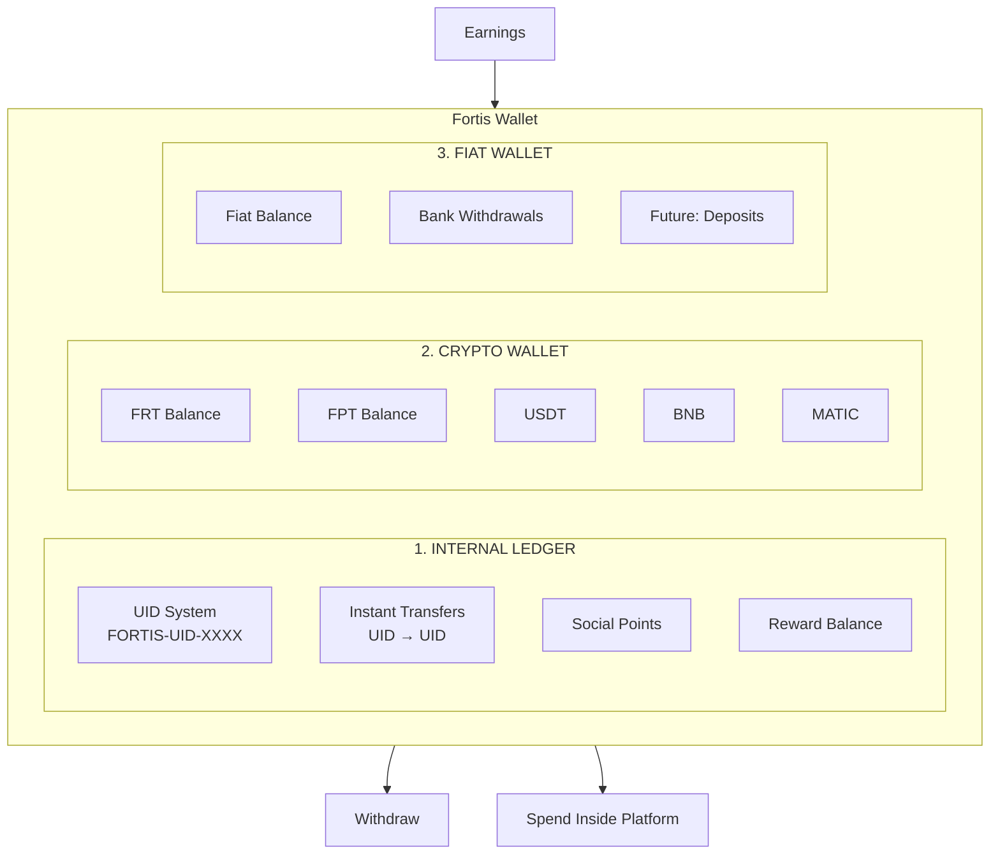
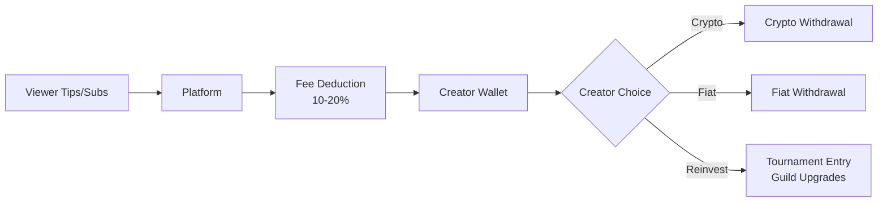

# Wallet

> **One wallet. All earnings. Real ownership. Real payouts.**

The Wallet is a comprehensive financial system that combines **internal ledger technology**, **on-chain crypto**, and **fiat withdrawals** into a single, seamless experience. All your earnings—from social points to tournament prizes to creator revenue—land in one place.

<Warning>
  **No External Wallet Required:** FortisArena provides everything. No MetaMask, no Trust Wallet, no seed phrases to manage.
</Warning>

---

## 🎯 Core Philosophy

```
Social Points + Tournament Rewards + Streaming Revenue + Creator Tips + Organization Income
                                    ↓
                         ONE UNIFIED WALLET
                                    ↓
                    Withdraw as Crypto OR Fiat
```

**Everything you earn on FortisArena lands in your Wallet:**
- ✅ Social platform points (rank progression)
- ✅ Tournament winnings (FRT/FPT tokens)
- ✅ Livestream tips & subscriptions
- ✅ Creator sponsorships
- ✅ Guild revenue shares
- ✅ Organization salaries
- ✅ Referral rewards
- ✅ MVP & performance bonuses

---

## 🧩 Wallet Architecture

The Wallet consists of **three integrated layers**:



---

## 🔹 1. Internal Ledger Wallet

### What It Is

The Internal Ledger is a **high-speed, gasless accounting system** that tracks all platform activity using a PostgreSQL database synchronized with blockchain.

### Key Features

| Feature | Description |
|:--------|:------------|
| **Speed** | Instant transfers (milliseconds) |
| **Cost** | Completely free |
| **Tracking** | Every transaction logged |
| **Sync** | Auto-synced with on-chain balances |
| **Gas** | No gas fees for internal transfers |

### UID System (User Identifier)

Every user receives a unique identifier:

```
Format: FORTIS-UID-XXXX
Example: FORTIS-UID-7842
```

**Use UID for:**
- Platform-to-platform transfers
- Tips to other users
- Guild payouts
- Organization salaries
- Rewards distribution
- Split payments

<Info>
  **No wallet address needed** for internal transfers. Just use the UID!
</Info>

### Internal Transfer Examples

| Action | From | To | Time | Fee |
|:-------|:-----|:---|:-----|:----|
| Tip creator | Your UID | Creator UID | Instant | Free |
| Guild payout | Guild UID | Player UID | Instant | Free |
| Squad split | Squad UID | Members | Instant | Free |
| Tournament prize | Platform | Winner UID | Instant | Free |

---

## 🔹 2. Crypto Wallet (On-Chain)

### Supported Assets (Phase 1)

| Token | Symbol | Use Case | Network |
|:------|:-------|:---------|:--------|
| **Fortis Token** | FRT | Governance, staking, premium | BNB Smart Chain |
| **Fortis Points** | FPT | Rewards, tournaments, tips | BNB Smart Chain |
| **Tether** | USDT | Stable value | BNB Smart Chain |
| **BNB** | BNB | Gas fees, trading | BNB Smart Chain |
| **Polygon** | MATIC | L2 transactions | Polygon |

### Features

**Deposit:**
- Normal blockchain confirmation time (3-30 minutes)
- Auto-credited to wallet
- Email notification on arrival

**Withdraw:**
- Withdraw to any external wallet
- Auto gas fee calculation
- Network selection (BSC/Polygon)
- Withdrawal limits apply

**Internal ↔ On-Chain Sync:**
- Seamless conversion between internal and on-chain
- 1:1 ratio with minimal fees
- Auto-reconciliation

---

## 🔹 3. Fiat Wallet

### Overview

Withdraw your earnings directly to your bank account in your local currency.

For accounting purposes, fiat is also tracked on the internal ledger:
- **Fiat Balance** = Your withdrawable bank balance
- **Tokenized representation** for transparent accounting
- **Full audit trail** of all transactions

### Setup

<Steps>
  <Step title="Add Bank Account">
    Enter bank details in wallet settings
  </Step>
  
  <Step title="Complete KYC">
    Basic identity verification required
  </Step>
  
  <Step title="Verification">
    Bank account verified (1-2 business days)
  </Step>
  
  <Step title="Ready">
    Withdraw earnings anytime!
  </Step>
</Steps>

### Withdrawal Details

| Aspect | Details |
|:-------|:--------|
| **Minimum** | $10 equivalent |
| **Maximum** | $10,000/day (increases with verification level) |
| **Processing** | 10 minutes to 24 hours |
| **Fee** | 1-2% depending on region |
| **Currencies** | USD, EUR, GBP, +50 more |


---

## 🪙 Balance Types Explained

Your wallet dashboard shows **multiple balances** in one unified interface:

### 💰 Fiat Balance
- **What:** Bank withdrawable amount
- **Source:** Crypto sales, direct fiat earnings
- **Use:** Withdraw to bank account

### 🪙 Crypto Balance
- **FRT:** Governance token for staking/voting
- **FPT:** Reward token for tournaments/tips
- **USDT/BNB/MATIC:** Standard crypto assets
- **Use:** External transfers, trading, holding

### ⭐ Reward Balance
- **What:** Tournament winnings, bonuses, guild shares
- **Auto-credited:** Yes, instantly after event
- **Convertible:** To FRT or Fiat

### 🧠 Social Points
- **What:** Rank progression points (NOT withdrawable)
- **Use:** Social platform rank only
- **Separate:** Not mixed with monetary balances

### 🎁 Pending Balance
- **Locked:** Tournament prizes under review
- **Escrow:** Dispute resolution holds
- **Scheduled:** Future payouts (organization salaries)

### 💎 Staked Balance
- **Locked:** FRT staked for platform access
- **Unlocks:** Organization status, higher limits, governance
- **Duration:** Based on staking tier

---

## 🏆 Earning Sources (All Auto-Credited)

### Automatic Credit System

**No manual claiming required!** All earnings auto-credit to your wallet:

| Source | Balance Type | Timing |
|:-------|:-------------|:-------|
| **Tournament Winnings** | Reward → FRT/FPT | Instantly after match |
| **MVP Bonuses** | Reward → FPT | Post-match |
| **Guild Revenue Share** | Reward → FRT | Weekly |
| **Organization Salary** | Fiat → Bank | Scheduled (bi-weekly/monthly) |
| **Livestream Tips** | FPT | Real-time |
| **Subscriptions** | Fiat/Reward | Daily aggregate |
| **Creator Sponsorships** | Fiat/FRT | As per contract |
| **Referral Rewards** | FPT | Instantly |
| **Staking Rewards** | FRT | Daily |
| **Rank 4 Revenue Share** | FRT | Monthly |

### Auto-Credit Flow

```
Event Occurs → Smart Contract Trigger → Internal Ledger Update → Balance Credited → Notification Sent
```

<Info>
  **Example:** Win tournament → 30 seconds later → FRT in wallet → Email notification
</Info>

---

## 🎥 Livestream Revenue Flow

### How Creator Earnings Work



### Creator Revenue Breakdown

| Source | Platform Fee | Creator Gets |
|:-------|:-------------|:-------------|
| Tips | 10% | 90% |
| Subscriptions | 20% | 80% |
| Sponsorships | 5% | 95% |
| Premium Content | 15% | 85% |

---

## 🧠 Smart Features

### 🔐 1. Balance Segmentation

For security, your balance is automatically segmented:

| Segment | Status | Use Case |
|:--------|:-------|:---------|
| **Spendable** | Available immediately | Transfers, purchases |
| **Locked** | Tournament pending | Entry fees held |
| **Escrow** | Dispute hold | Under investigation |
| **Pending** | Review period | Large withdrawals |
| **Staked** | Platform access tier | Unlocks features while locked |

### ⚙️ 2. Auto Rule Engine

**Smart rules automatically manage your funds:**

| Rule | Trigger | Action |
|:-----|:--------|:-------|
| **Tournament Split** | Win prize | 70% instant, 30% after 24hr verification |
| **Org Salary** | Payday | Auto-transfer to Fiat wallet |
| **Guild Revenue** | Weekly | Auto-split to all members |
| **Tax Reserve** | Earnings | Auto-set aside % (future) |
| **Reinvest** | Threshold | Auto-buy tournament entries |

### 📊 3. Wallet Analytics

**Powerful insights into your earnings:**

- **Monthly Earnings Report**
  - Total earned
  - Source breakdown
  - Growth trends

- **Source Analysis**
  - Tournaments: $X
  - Streaming: $Y
  - Guild: $Z
  - Social: $W

- **Withdrawal History**
  - Amounts
  - Methods
  - Status

- **Tax-Ready Reports** (Future)
  - Annual summaries
  - Category breakdowns
  - Exportable CSV/PDF

### 🔁 4. Internal Market Usage

**Spend wallet balance inside FortisArena:**

| Purchase | Payment Method |
|:---------|:---------------|
| Tournament entry | FRT / FPT / Fiat |
| Guild slot upgrade | FRT / Fiat |
| Post visibility boost | FPT |
| Premium creator tools | FRT |
| NFT marketplace | FRT / FPT |
| Subscription upgrades | Fiat |

<Info>
  **Money stays in ecosystem** = Lower fees + Faster transactions
</Info>

---

## 🧱 Security Model

### Multi-Layer Protection

| Layer | Implementation |
|:------|:---------------|
| **Ledger Accounting** | PostgreSQL with audit trails |
| **Role-Based Access** | Different permissions per user type |
| **Withdrawal Limits** | Daily/weekly limits based on verification |
| **AI Monitoring** | Suspicious activity detection |
| **Manual Review** | High-value transaction approval |
| **Cold/Warm/Hot** | Fund separation (platform side) |

### Withdrawal Limits

| Verification Level | Daily Crypto | Daily Fiat | Monthly Total |
|:-------------------|:-------------|:-----------|:--------------|
| **Email Only** | $0 | $0 | Social only |
| **KYC Basic** | $1,000 | $500 | $10,000 |
| **KYC Standard** | $5,000 | $2,000 | $50,000 |
| **KYC Advanced** | $25,000 | $10,000 | $200,000 |
| **Organization** | $100,000 | $50,000 | Unlimited |

### Fraud Protection

- **UID Transfer Limits:** Max transfers per hour
- **Rapid Withdraw Protection:** Velocity checks
- **Match Fixing Link:** Wallet freeze if cheating detected
- **Dispute Freeze:** Funds held during investigations
- **Full Audit Trail:** Every transaction logged

---

## 🆔 User Identity (UID)

### Your Fortis Identity

```
Format: FORTIS-UID-[4 DIGITS]
Example: FORTIS-UID-7842
```

**Permanent:** Never changes, even if you change username

**Use for:**
- Receiving payments
- Internal transfers
- Tax reporting
- Support tickets
- API access

### UID vs Username

| Aspect | UID | Username |
|:-------|:----|:---------|
| **Format** | FORTIS-UID-XXXX | @yourname |
| **Changes** | Never | Can change |
| **Public** | Yes | Yes |
| **For Transfers** | ✅ Primary | ❌ Secondary |
| **Support** | ✅ Use this | Also works |

---

## 💸 How to Withdraw

### Crypto Withdrawal

<Steps>
  <Step title="Go to Wallet">
    Click "Withdraw" → "Crypto"
  </Step>
  
  <Step title="Select Asset">
    Choose FRT, FPT, USDT, BNB, or MATIC
  </Step>
  
  <Step title="Enter Address">
    Paste external wallet address
  </Step>
  
  <Step title="Confirm Amount">
    Review after fees
  </Step>
  
  <Step title="Verify">
    2FA confirmation
  </Step>
  
  <Step title="Wait">
    3-30 minutes for blockchain confirmation
  </Step>
</Steps>

### Fiat Withdrawal

<Steps>
  <Step title="Go to Wallet">
    Click "Withdraw" → "Fiat"
  </Step>
  
  <Step title="Select Bank">
    Choose linked bank account
  </Step>
  
  <Step title="Enter Amount">
    Min $10, max based on limit
  </Step>
  
  <Step title="Review Fees">
    1-2% fee displayed
  </Step>
  
  <Step title="Confirm">
    2FA + Email confirmation
  </Step>
  
  <Step title="Wait">
    10 minutes to 24 hours
  </Step>
</Steps>

---

## 🚀 Future Extensions

### Coming Soon

| Feature | Description | Timeline |
|:--------|:------------|:---------|
| **Virtual Debit Card** | Spend Fortis balance anywhere | Q3 2026 |
| **Guild Shared Wallet** | Multi-sig treasury for guilds | Q2 2026 |
| **Organization Treasury** | Advanced fund management | Q2 2026 |
| **Tokenized Rewards** | NFT-based achievement rewards | Q3 2026 |
| **Staking for Players** | Lock FRT for tournament benefits | Q2 2026 |
| **Wallet Reputation** | Financial history = trust score | Q4 2026 |
| **Crypto Deposits** | Buy crypto with fiat inside app | Q2 2026 |

---

## 📊 Comparison: Fortis vs Others

| Feature | Fortis Wallet | MetaMask | Bank Account |
|:--------|:---------------|:---------|:-------------|
| **Setup** | 30 seconds | 10+ minutes | Days |
| **Social Earnings** | ✅ Native | ❌ | ❌ |
| **Gaming Rewards** | ✅ Auto | Manual | ❌ |
| **Fiat Withdrawal** | ✅ Built-in | Exchange needed | N/A |
| **Gas Fees** | ✅ None (internal) | Always | N/A |
| **Recovery** | ✅ Email/Phone | Seed phrase only | Bank process |
| **Speed** | ✅ Instant | Blockchain | 1-3 days |

---

## 🎯 Why This Wallet is Powerful

✅ **Real money** - Not just play points
✅ **Real careers** - Sustainable creator economy
✅ **Real payouts** - Crypto + Fiat options
✅ **Web3 aligned** - Blockchain when needed
✅ **Esports ready** - Tournament optimized
✅ **Creator friendly** - Multiple revenue streams
✅ **Organization scalable** - Treasury management
✅ **Investor ready** - Transparent accounting

---

## 📞 Support

**Wallet Issues:**
- Email: wallet@fortisarena.io
- Discord: #wallet-help
- In-app: Support ticket

**Emergency:**
- Suspected fraud: security@fortisarena.io
- Freeze account: 24/7 hotline

---

> **Fortis Wallet** - Your earnings, your way. Instant inside, flexible outside.
