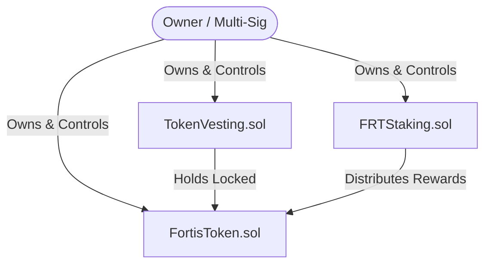
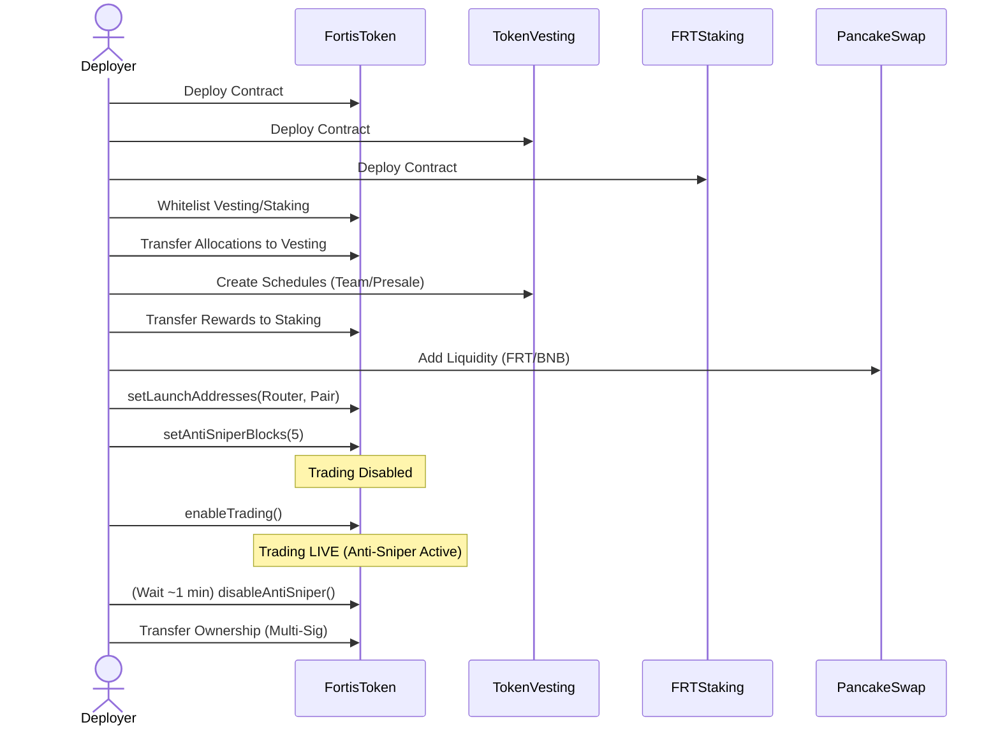

# FRT Smart Contract Documentation

**Version:** 1.1  
**Last Updated:** January 2026

## Overview

This document provides comprehensive technical documentation for the FortisArena smart contract ecosystem, consisting of three core contracts:

*   **`FortisToken.sol`**: The main FRT token contract (BEP-20)
*   **`TokenVesting.sol`**: Vesting contract for token locks
*   **`FRTStaking.sol`**: Staking contract for rewards

All contracts are written in Solidity `^0.8.20` and use OpenZeppelin v5 libraries.

### Architecture Overview



### Contract Summary

| Contract | Purpose | Standard |
| :--- | :--- | :--- |
| **FortisToken** | Main utility token | BEP-20 |
| **TokenVesting** | Lock tokens with cliff and linear vesting | Custom |
| **FRTStaking** | Stake tokens to earn rewards | Custom |

## 1. FortisToken Contract

### Basic Information

| Property | Value |
| :--- | :--- |
| **Token Name** | FRT |
| **Symbol** | FRT |
| **Decimals** | 18 |
| **Total Supply** | 200,000,000 FRT (Fixed) |
| **Blockchain** | BNB Smart Chain (BSC) |
| **Solidity Version** | `^0.8.20` |
| **OpenZeppelin** | v5 |

### Security Features

| Feature | Description |
| :--- | :--- |
| **No Mint Function** | Supply is fixed at 200M and cannot be increased |
| **Burnable** | Tokens can be permanently burned to reduce supply |
| **Ownable2Step** | Two-step ownership transfer prevents accidental loss |
| **Anti-Sniper** | Reverts buys in first 3-5 blocks after trading enabled |
| **Max Transaction** | 1% of supply (2,000,000 FRT) per transaction |
| **Max Wallet** | 2% of supply (4,000,000 FRT) maximum holding |
| **Launch Helper** | `setLaunchAddresses()` configures router and pair safely |
| **Trading Switch** | Trading disabled until owner enables (requires launch config) |
| **Blacklist** | Block malicious addresses from transferring |
| **Whitelist** | Allow specific addresses to transfer before trading |
| **Pausable** | Emergency pause all transfers |
| **Reentrancy Guard** | Prevent reentrancy attacks |
| **0% Tax** | No buy/sell/transfer tax |

### Key Functions

#### Launch Configuration (MUST call before trading)
```solidity
function setLaunchAddresses(address router, address pair) external onlyOwner
```
Configures the DEX router and pair addresses. Automatically:
*   Excludes router from limits and maxWallet
*   Sets pair as AMM pair
*   Excludes pair from limits and maxWallet
*   Sets `launchConfigured = true`

#### Trading Control
```solidity
function enableTrading() external onlyOwner
```
Enables public trading. Requirements:
*   Can only be called once
*   `launchConfigured` must be true
*   Cannot be disabled once enabled

#### Anti-Sniper Configuration
```solidity
function setAntiSniperBlocks(uint256 blocks) external onlyOwner
```
Sets anti-sniper duration (3-5 blocks). Can only be called before trading is enabled.

#### Limit Controls (One-Way)
```solidity
function disableAntiSniper() external onlyOwner
function disableMaxTx() external onlyOwner
function disableMaxWallet() external onlyOwner
```
Permanently disable protection features. Cannot be re-enabled.

#### Address Management
```solidity
function setExcludedFromLimits(address account, bool excluded) external onlyOwner
function setExcludedFromMaxWallet(address account, bool excluded) external onlyOwner
function setWhitelisted(address account, bool whitelisted) external onlyOwner
function setBlacklisted(address account, bool blacklisted) external onlyOwner
function setAMMPair(address pair, bool status) external onlyOwner
```

#### Emergency Functions
```solidity
function pause() external onlyOwner
function unpause() external onlyOwner
function recoverTokens(address token, uint256 amount) external onlyOwner
function recoverETH() external onlyOwner
```

### Owner Capabilities

| Action | Possible | Notes |
| :--- | :--- | :--- |
| Configure launch addresses | **Yes** | Once only |
| Enable trading | **Yes** | Once only, requires launch config |
| Set anti-sniper blocks (3-5) | **Yes** | Before trading only |
| Disable limits | **Yes** | Cannot re-enable |
| Blacklist addresses | **Yes** | For bots only |
| Whitelist addresses | **Yes** | For presale/team |
| Pause transfers | **Yes** | Emergency only |
| Transfer ownership | **Yes** | Two-step process |

### Owner Restrictions (What Owner CANNOT Do)

| Action | Possible | Reason |
| :--- | :--- | :--- |
| Mint new tokens | **No** | No mint function exists |
| Increase supply | **No** | Fixed supply constant |
| Set tax | **No** | No tax function exists |
| Blacklist owner | **No** | Hardcoded protection |
| Blacklist contract | **No** | Hardcoded protection |
| Re-enable disabled features | **No** | One-way disable only |
| Enable trading without launch config | **No** | Safety check enforced |

### Custom Errors

| Error | Description |
| :--- | :--- |
| `ZeroAddress()` | Address cannot be zero |
| `InvalidAmount()` | Amount cannot be zero |
| `TradingNotEnabled()` | Trading is not yet enabled |
| `AlreadyEnabled()` | Feature is already enabled |
| `AlreadyDisabled()` | Feature is already disabled |
| `AlreadyConfigured()` | Launch already configured |
| `LaunchNotConfigured()` | Must call `setLaunchAddresses` first |
| `InvalidAntiSniperBlocks()` | Blocks must be 3-5 |
| `AddressIsBlacklisted()` | Address is blacklisted |
| `SniperDetected()` | Sniper bot detected |
| `ExceedsMaxTransaction()` | Amount exceeds max TX |
| `ExceedsMaxWallet()` | Balance would exceed max wallet |
| `BatchTooLarge()` | Batch size exceeds 100 |
| `CannotBlacklistOwner()` | Cannot blacklist owner |
| `CannotBlacklistContract()` | Cannot blacklist contract |
| `ETHTransferFailed()` | ETH transfer failed |

## 2. TokenVesting Contract

### Purpose
Locks tokens with configurable cliff periods and linear vesting. Used for team, advisor, and presale token locks.

### Features

| Feature | Description |
| :--- | :--- |
| **Multiple Schedules** | Multiple vesting schedules per beneficiary |
| **Configurable Cliff** | Set cliff period before any tokens unlock |
| **Linear Vesting** | Tokens unlock linearly after cliff |
| **Revocable** | Optional ability to revoke unvested tokens |
| **Batch Creation** | Create multiple schedules in one transaction |
| **Transparent** | All schedules viewable on-chain |

### Vesting Categories

| Category ID | Type |
| :--- | :--- |
| **0** | Team |
| **1** | Advisor |
| **2** | Presale |
| **3** | Other |

### Key Functions

#### Create Vesting Schedule
```solidity
function createVestingSchedule(
    address _beneficiary,
    uint256 _totalAmount,
    uint256 _startTime,
    uint256 _cliffDuration,
    uint256 _vestingDuration,
    bool _revocable,
    uint8 _category
) external onlyOwner returns (bytes32 scheduleId)
```

#### Release Tokens
```solidity
function release(bytes32 _scheduleId) external
function releaseAll(address _beneficiary) external
```

#### View Functions
```solidity
function getReleasableAmount(bytes32 _scheduleId) external view returns (uint256)
function getVestedAmount(bytes32 _scheduleId) external view returns (uint256)
function getBeneficiarySchedules(address _beneficiary) external view returns (bytes32[] memory)
```

## 3. FRTStaking Contract

### Purpose
Allows FRT holders to stake tokens to unlock platform features and access tiers. Staking provides **utility benefits**, not financial returns.

### Access Tiers

| Tier | Lock Duration | Minimum Stake | Unlocks |
| :--- | :--- | :--- | :--- |
| **1** | Flexible | 1,000 FRT | Higher withdrawal limits |
| **2** | 90 Days | 5,000 FRT | Verified badge, fee discounts |
| **3** | 180 Days | 25,000 FRT | Tournament hosting rights |
| **4** | 365 Days | 50,000 FRT | Organization registration |
| **5** | 730 Days | 100,000+ FRT | Premier partner status |

### Features

| Feature | Description |
| :--- | :--- |
| **Utility Staking** | Stake for platform access, not yield |
| **Flexible Options** | No-lock tier available |
| **Tier Progression** | Unlock higher tiers with more stake |
| **Early Unstake** | Withdraw early with 20% penalty |
| **Governance Weight** | Voting power based on stake tier |

### Key Functions

#### Staking
```solidity
function stake(uint256 _poolId, uint256 _amount) external
function unstake(uint256 _stakeIndex) external
function claimRewards(uint256 _stakeIndex) external
function compoundRewards(uint256 _stakeIndex) external
function emergencyWithdraw(uint256 _stakeIndex) external
```

#### View Functions
```solidity
function pendingRewards(address _user, uint256 _stakeIndex) external view returns (uint256)
function getUserStakes(address _user) external view returns (Stake[] memory)
function getPoolInfo(uint256 _poolId) external view returns (Pool memory)
```

#### Admin Functions
```solidity
function createPool(uint256 _lockDuration, uint256 _apy, uint256 _minStake) external onlyOwner
function updatePool(uint256 _poolId, uint256 _apy, bool _active) external onlyOwner
function depositRewards(uint256 _amount) external onlyOwner
function withdrawRewards(uint256 _amount) external onlyOwner
```

## 4. Deployment Guide

### Prerequisites
```bash
npm install @openzeppelin/contracts@^5.0.0
```

### Deployment Order
1.  **Deploy FortisToken**: `FortisToken.deploy(ownerAddress)`
2.  **Deploy TokenVesting**: `TokenVesting.deploy(frt.address, ownerAddress)`
3.  **Deploy FRTStaking**: `FRTStaking.deploy(frt.address, ownerAddress)`

### Launch Sequence



## 5. Security Recommendations

*   **Audit:** Get professional audit before mainnet deployment
*   **Multi-Sig:** Transfer ownership to Gnosis Safe multi-sig
*   **Timelock:** Consider adding timelock for major operations
*   **Testnet:** Thoroughly test on BSC Testnet first
*   **Verification:** Verify all contracts on BscScan

## 6. License

All contracts are released under the MIT License.

> **FortisArena** - Building the Future of Competitive Gaming
