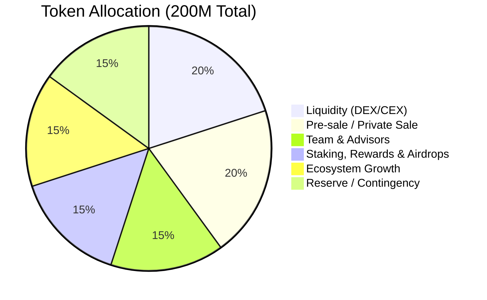

# FortisArena (FRT) Tokenomics

**Version:** 1.1  
**Last Updated:** January 2026

## Executive Summary

This document outlines the comprehensive tokenomics model for the Fortis Token (FRT), the native utility token of the FortisArena gaming platform. The model is designed to foster long-term growth, ensure ecosystem stability, and build investor confidence through transparency and robust, audited smart contracts.

## Token Overview

| Parameter | Value |
| :--- | :--- |
| **Token Name** | Fortis Token |
| **Ticker Symbol** | FRT |
| **Blockchain** | BNB Smart Chain (BSC) |
| **Token Standard** | BEP-20 |
| **Contract Address** | `0xFf10d933E1Ca7799866B5D2A615e562CAd306c96` |
| **Total Supply** | 200,000,000 FRT (Fixed) |
| **Decimals** | 18 |
| **Contract Type** | Non-Mintable, Burnable, Pausable |
| **Ownership** | Ownable2Step (Multi-sig ready) |

## Token Allocation

The total supply of 200,000,000 FRT is allocated across six core categories to ensure a balanced distribution for all stakeholders and long-term project success.

| Category | Percentage | Token Amount | Purpose | Wallet Address |
| :--- | :--- | :--- | :--- | :--- |
| **Liquidity (DEX/CEX)** | 20% | 40,000,000 | Initial DEX liquidity, CEX listing fees, market making | `0xFB53E8D93212F29aaA99BaA5fb708618ea8FDEc5` |
| **Pre-sale / Private Sale** | 20% | 40,000,000 | Initial fundraising from strategic partners | `0x9eE1A487F1A22c6c63204639b028E451Bf3Ae0c0` |
| **Team & Advisors** | 15% | 30,000,000 | Incentivize and retain core team | `0xD0C8859C37F1f0D292A128e34dB56891048c7E98` |
| **Staking, Rewards & Airdrops** | 15% | 30,000,000 | Reward users and governance participation | `0x780180B6aC026761d32397f608bc29FD6e0076C8` |
| **Ecosystem Growth** | 15% | 30,000,000 | Fund community programs and partnerships | `0x29FDC47e6F3D0413562f4E1a864fE6deE75dfDEc` |
| **Reserve / Contingency** | 15% | 30,000,000 | Strategic initiatives and expenses | `0xcd88Ac3758b0792b53d165187d6BDd5bF62ff091` |

## Vesting Schedules

To prevent market volatility and align long-term interests, all major allocations are subject to strategic vesting schedules managed by a dedicated TokenVesting smart contract.

| Category | TGE Unlock | Cliff Period | Vesting Period | Monthly Release |
| :--- | :--- | :--- | :--- | :--- |
| **Team & Advisors** | 0% | 12 Months | 24 Months (Linear) | ~1,250,000 FRT |
| **Pre-sale / Private Sale** | 10% | 3 Months | 9 Months (Linear) | 4,000,000 FRT |
| **Staking & Governance** | 0% | None | 48 Months (Emission) | ~625,000 FRT |
| **Liquidity (DEX/CEX)** | 15% | None | As needed | N/A |
| **Ecosystem Growth** | 0% | None | As needed (Multi-sig) | N/A |
| **Reserve / Contingency** | 0% | 12 Months | As needed (Multi-sig) | N/A |

<Info>
**Definitions:**
*   **TGE (Token Generation Event):** The initial unlock at the moment of launch.
*   **Cliff:** A period during which no tokens are unlocked.
*   **Vesting:** The gradual release of tokens over time after the cliff.
</Info>

## Circulating Supply Forecast

This table projects the growth of the circulating supply over the first 12 months.

| Month | Event | New Tokens Unlocked | Cumulative Circulating | % of Total |
| :--- | :--- | :--- | :--- | :--- |
| **0 (Launch)** | TGE + Liquidity | 10,000,000 | 10,000,000 | 5.0% |
| **1-3** | Staking Rewards | ~1,875,000 | 11,875,000 | 5.9% |
| **4** | Private Sale Vesting Starts | 4,625,000 | 16,500,000 | 8.25% |
| **5-11** | Private Sale + Staking | ~4,625,000/mo | - | - |
| **12** | Team Vesting Starts | ~5,875,000 | 54,750,000 | 27.4% |

## Pricing Structure

| Stage | Price (USD) | Tokens |
| :--- | :--- | :--- |
| **Private Sale** | $0.075 | 40,000,000 FRT |
| **Launch Price** | $0.10 | - |

## Token Utility

The value of FRT is derived from its deep integration into the FortisArena ecosystem.

### Core Gameplay & Access
*   **Tournament Entry:** Pay FRT to enter exclusive tournaments with high prize pools.
*   **Premium Features:** Unlock advanced analytics, private lobbies, and other premium features by holding or spending FRT.

### Economic Incentives
*   **Staking:** Stake FRT in the FRTStaking contract to earn a share of the rewards pool.
*   **Rewards:** Earn FRT as prizes for winning tournaments and completing in-game challenges.

### Governance
*   **DAO Voting:** Hold FRT to vote on key platform decisions, such as new game integrations, feature development, and treasury spending.

## Deflationary Mechanism

*   **Buyback & Burn:** A portion of platform revenue will be used to systematically buy FRT from the open market and permanently burn it using the `burn()` function, reducing the total supply over time.

## Staking Pools

FRT holders can stake their tokens in the dedicated `FRTStaking` contract to earn rewards. Higher APY is offered for longer lock periods.

| Pool | Lock Duration | APY | Minimum Stake |
| :--- | :--- | :--- | :--- |
| **Flexible** | None | 10% | 1,000 FRT |
| **Bronze** | 30 Days | 15% | 1,000 FRT |
| **Silver** | 90 Days | 20% | 1,000 FRT |
| **Gold** | 180 Days | 25% | 1,000 FRT |
| **Platinum** | 365 Days | 30% | 1,000 FRT |

## Security & Trust

The following measures are implemented in the `FortisToken.sol` contract and project operations to build maximum investor confidence:

| Measure | Description |
| :--- | :--- |
| **No Mint Function** | The contract has a fixed supply and cannot be inflated. |
| **Verified & Audited Contract** | Smart contracts publicly audited by a top-tier firm. |
| **Locked Liquidity** | 100% of initial DEX LP tokens locked for 12 months via a trusted third-party service. |
| **Locked Team Tokens** | All team tokens subject to 12-month cliff and vesting via the TokenVesting contract. |
| **Public Wallets** | All project wallet addresses published on the official website. |
| **Team KYC** | Core team undergoes KYC verification with a reputable third-party service. |
| **Multi-Sig Treasury** | Major funds secured in a multi-signature wallet (e.g., Gnosis Safe). |
| **Ownable2Step** | Ownership transfer requires a two-step process, preventing accidental transfers to wrong addresses. |
| **Launch Helper** | A dedicated `setLaunchAddresses()` function minimizes human error during the critical launch phase. |
| **Anti-Sniper Protection** | Early sniper bots are blocked for the first 3-5 blocks of trading. |

## Conclusion

This tokenomics structure is engineered to create a sustainable and thriving economy for FortisArena, aligning the interests of the team, investors, and community for long-term success.

> **FortisArena** - Building the Future of Competitive Gaming