# Tokenomics Overview

> **Utility + Access + Commitment — NOT Equity, NOT Revenue Share**

FortisArena uses a **dual-token system** designed for long-term sustainability, legal safety, and real platform utility. Both tokens serve strictly different purposes and have **no ownership or profit-sharing rights** in the company.

<Warning>
  **Important Legal Distinction**
  
  ❌ Tokens are **NOT** equity  
  ❌ Tokens are **NOT** revenue share  
  ❌ Tokens are **NOT** company ownership  
  
  ✅ Tokens = **Utility + Access + Commitment** only
</Warning>

---

## 🎯 First Principles

This model prioritizes:

| Principle | Implementation |
|:----------|:---------------|
| **Legal Safety** | No dividend language, no profit promises |
| **Founder Control** | Company retains revenue, fees, roadmap |
| **Platform Flexibility** | Tokens support ecosystem, not control it |
| **Real Utility** | Access, reputation, and in-platform usage |
| **Regulatory Compliance** | Works across Asia, EU, Middle East |

---

## 🪙 Token Structure

```mermaid
flowchart TB
    subgraph FRT["FRT"]
        FRT_S[Supply: 200M Fixed]
        FRT_U[Utility: Power, Access, Trust]
        FRT_U1[Organization Registration]
        FRT_U2[Tournament Hosting]
        FRT_U3[Reputation Staking]
        FRT_U4[Limited Governance]
    end
    
    subgraph FPT["FPT — Fortis Points Token"]
        FPT_S[Supply: 1B Fixed]
        FPT_U[Utility: Usage, Rewards, Activity]
        FPT_U1[Tournament Rewards]
        FPT_U2[Creator Tips]
        FPT_U3[Boosts & Perks]
        FPT_U4[Cosmetics]
    end
    
    FRT -->|Unlocks Platform Power| Platform[FortisArena Platform]
    FPT -->|Powers Daily Activity| Platform
```



### Key Differences

| Aspect | FRT | FPT |
|:-------|:----|:----|
| **Full Name** | FRT | FPT |
| **Supply** | 200,000,000 (Fixed) | 1,000,000,000 (Fixed) |
| **Purpose** | Power, Access, Trust | Usage, Rewards, Activity |
| **Launch** | Phase 1 (Live) | Phase 2 (Coming Soon) |
| **Governance** | Limited (non-financial only) | None |
| **Who Needs It** | Organizations, serious users | All players, creators |
| **Revenue Rights** | ❌ None | ❌ None |

---

## 🟣 FRT

<Info>
  **Contract Address (BSC)**: `0xFf10d933E1Ca7799866B5D2A615e562CAd306c96`
</Info>

### What FRT Is

FRT represents **serious commitment** to the platform. It's required for organizations, tournament hosts, and power users who want advanced features.

### What FRT Is NOT

- ❌ Profit-sharing token
- ❌ Dividend-paying asset
- ❌ Company equity
- ❌ Guaranteed return investment

### Core Use Cases

#### 1️⃣ Access Staking (No Money Promised)

Stake FRT to unlock platform capabilities:

| Feature | FRT Required | Benefit |
|:--------|:-------------|:--------|
| **Organization Status** | 10,000 FRT | Register as esports org |
| **Tournament Hosting** | 5,000 FRT | Create custom tournaments |
| **Guild Expansion** | Variable | Unlock larger guild sizes |
| **Advanced Analytics** | 2,000 FRT | Detailed stats & reports |
| **Higher Limits** | 1,000 FRT | Increased withdrawal caps |
| **Verified Badge** | 5,000 FRT | Blue checkmark status |

<Note>
  **Higher stake = Higher responsibility**
  
  Organizations with more FRT staked have more to lose if they violate rules.
</Note>

#### 2️⃣ Tournament Entry Fees

Serious competitions require **FRT for entry**:

| Tournament Tier | Entry Fee | Est. Value |
|:----------------|:----------|:-----------|
| **Amateur** | 10 FRT | ~$1-2 |
| **Semi-Pro** | 50 FRT | ~$5-10 |
| **Pro** | 200 FRT | ~$20-40 |
| **Elite** | 500 FRT | ~$50-100 |
| **Legend** | 2,500 FRT | ~$250-500 |

**Why FRT for entry?**
- Ties serious competition to access token
- Creates natural demand for FRT
- Entry fees recycled to prize pools (mostly in FPT)

#### 3️⃣ Occasional Premium Rewards

While **90% of rewards are FPT**, special achievements earn **FRT**:

| Achievement | FRT Reward | Occurrence |
|:------------|:-----------|:-----------|
| **International Champion** | 50,000-500,000 FRT | Annual |
| **Season Grand Winner** | 25,000-100,000 FRT | Quarterly |
| **Major Creator Grant** | 10,000-50,000 FRT | Monthly |
| **Critical Bug Bounty** | 5,000-25,000 FRT | As found |

#### 4️⃣ Lock & Burn Mechanism

When FRT is used for platform features:

| Action | Burn % | Time-Locked % | Result |
|:-------|:-------|:--------------|:-------|
| Org Registration | 20% | 80% (1 year) | Supply pressure |
| Tournament Hosting | 10% | 90% (6 months) | Reduced circulation |
| Guild Expansion | 15% | 85% (1 year) | Long-term holding |

> This creates **demand without payout obligations** — supply pressure from real usage.

#### 5️⃣ Reputation Staking (Trust System)

Organizations, guilds, and hosts must stake FRT as collateral:

```
Scenario: Tournament host stakes 50,000 FRT
↓
If host commits fraud or allows cheating
↓
Stake gets SLASHED (partial or full)
↓
Victims compensated from slashed amount
```

**This creates a Web2 + Web3 hybrid trust system:**
- Traditional verification (KYC)
- Economic collateral (FRT stake)
- Transparent slashing (on-chain)

#### 6️⃣ Limited Governance (Non-Financial Only)

FRT holders can vote on:

✅ **Allowed Topics:**
- Which games to add next
- Tournament rule changes
- Community standards updates
- Feature priority ranking

❌ **NOT Allowed:**
- Treasury control
- Fee changes
- Revenue distribution
- Company decisions

### FRT Distribution (200M Total)

| Allocation | Percentage | Amount | Vesting/Lock |
|:-----------|:-----------|:-------|:-------------|
| **Team** | 15% | 30M | 2-4 year vesting |
| **Pre + Private** | 20% | 40M | 6-12 month lock |
| **Access Staking** | 15% | 30M | Utility pool |
| **Liquidity** | 20% | 40M | DEX liquidity |
| **Ecosystem** | 15% | 30M | Partnerships, grants |
| **Reserve** | 15% | 30M | Emergency & stability |

### Reserve Strategy

The 15% reserve exists for:

- **Emergency liquidity** during market shocks
- **Long-term platform stability**
- **Strategic partnerships** support
- **Market confidence** signaling

<Warning>
  Reserve is **NOT for dumping**. Protected by multi-sig and transparency requirements.
</Warning>

---

## 🔵 FPT — Fortis Points Token

<Warning>
  **Phase 2 Launch**: FPT will launch after platform reaches critical mass. No contract address yet.
</Warning>

### What FPT Is

FPT is the **in-platform currency** for daily activities, rewards, and micro-transactions. Think of it as "platform credits" that happen to be on the blockchain.

### What FPT Is NOT

- ❌ Governance token
- ❌ Power/acquisition token
- ❌ Revenue rights
- ❌ Investment vehicle

### Core Use Cases

#### 1️⃣ Rewards Distribution

Earn FPT for platform participation:

| Activity | Reward | Timing |
|:---------|:-------|:-------|
| **Tournament Win** | 100-10,000 FPT | Instant |
| **MVP Performance** | 500-2,000 FPT | Post-match |
| **Achievement Unlock** | 50-500 FPT | Instant |
| **Seasonal Ladder** | 1,000-50,000 FPT | End of season |
| **Creator Engagement** | Variable | Real-time |
| **Referral Bonus** | 100 FPT | On friend signup |

#### 2️⃣ In-Platform Spending

Use FPT for platform features:

| Purchase | FPT Cost | Benefit |
|:---------|:---------|:--------|
| **Guild Utilities** | 500-5,000 | Guild perks & features |
| **Creator Tips** | Any amount | Support streamers |
| **Visibility Boost** | 200-1,000 | Promote posts |
| **Cosmetic Perks** | Variable | Profile customization |
| **Free Tournaments** | 0 FPT | Practice & fun (no prize) |

**Spend Mechanics:**
- Some FPT gets **burned** (deflationary)
- Some FPT gets **recycled** to reward pool

#### 3️⃣ Utility Staking (NOT Investment)

Stake FPT for platform benefits (NOT APY):

| Stake Amount | Unlock | Duration |
|:-------------|:-------|:---------|
| 1,000 FPT | 5% fee discount | While staked |
| 5,000 FPT | Priority matchmaking | While staked |
| 10,000 FPT | Exclusive cosmetics | While staked |

<Warning>
  **NO APY PROMISES** — Staking FPT gives utility benefits only, not financial returns.
</Warning>

### FPT Distribution (1B Total)

| Allocation | Percentage | Amount | Purpose |
|:-----------|:-----------|:-------|:--------|
| **Rewards & Achievements** | 30% | 300M | Tournament prizes, MVP, ladders |
| **Ecosystem & Community** | 20% | 200M | Grants, partnerships |
| **Sales** | 15% | 150M | Public sale, liquidity |
| **Utility Staking** | 20% | 200M | Staking rewards pool |
| **Liquidity** | 10% | 100M | DEX liquidity |
| **Reserve** | 5% | 50M | Emergency buffer |

---

## 🔁 How Value Actually Builds

```
Platform Growth
      ↓
More Users + More Orgs + More Tournaments + More Guilds
      ↓
Users Need:
  • FRT to unlock power (org registration, hosting)
  • FPT to play & spend (entries, tips, boosts)
      ↓
FRT gets locked/burned
FPT circulates/burns
      ↓
Supply pressure + Real demand
      ↓
Market value reflects PRODUCT SUCCESS
```

> **No fake yield. Real usage only.**

---

## ⚖️ Legal Safety Checklist

Our token design passes these critical checks:

| Check | Status | How We Comply |
|:------|:-------|:--------------|
| **No Dividend Language** | ✅ | No profit-sharing mentioned |
| **No Profit Promises** | ✅ | No guaranteed returns |
| **No Revenue Share** | ✅ | Company keeps all revenue |
| **Utility-First Tokens** | ✅ | Access and usage only |
| **Delayed FPT Launch** | ✅ | Phase 2, after platform proven |
| **Clear ToS Separation** | ✅ | Platform ≠ DAO |
| **No Investment Contract** | ✅ | Howey test considerations |

**This model is designed to be compliant across:**
- 🇸🇬 Singapore (MAS guidelines)
- 🇦🇪 UAE (VARA framework)
- 🇪🇺 EU (MiCA regulations)
- 🇺🇸 USA (securities considerations)

---

## 🏗️ Platform Control (Company Structure)

**Company (FortisArena Inc.) Controls:**
- ✅ All revenue
- ✅ All fee structures
- ✅ Treasury management
- ✅ Product roadmap
- ✅ Partnership decisions
- ✅ Platform rules

**Tokens Support:**
- ✅ User engagement
- ✅ Ecosystem growth
- ✅ Platform utility
- ✅ Trust mechanisms

**Tokens Do NOT Control:**
- ❌ Company decisions
- ❌ Revenue distribution
- ❌ Platform ownership

---

## 📊 Comparison: Traditional vs Fortis Model

| Aspect | Traditional ICO | Fortis Model |
|:-------|:----------------|:-------------|
| **Token = Equity?** | Often implied | ❌ Explicitly NO |
| **Profit Sharing?** | Common promise | ❌ None |
| **Governance Scope** | Everything | Limited, non-financial only |
| **Legal Risk** | High | Minimized |
| **Founder Control** | Diluted | Retained |
| **Regulatory Fit** | Poor | Designed for compliance |
| **Value Source** | Speculation | Real platform usage |

---

## 🏆 Why This Model is Strong

✅ **Long-term sustainable** — No unsustainable yield promises
✅ **Investor-safe** — Clear utility, no misleading expectations
✅ **Founder-safe** — Retain control and flexibility
✅ **Regulator-safe** — Designed for compliance
✅ **Gamer-friendly** — Simple, useful, no financial complexity
✅ **Real economy** — Value from actual platform usage
✅ **No future regret** — Won't need to restructure later

---

## 📚 Learn More

- **[FRT Details](/tokenomics/frt)** — Deep dive into FRT
- **[FPT Details](/tokenomics/fpt)** — Deep dive into Fortis Points Token
- **[Smart Contracts](/smart-contracts)** — Technical documentation
- **[Staking Guide](/tokenomics/staking)** — How to stake (utility only)

---

> **Tokens are tools for the ecosystem, not claims on the company.**
