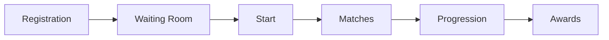

# Getting Started with Tournaments

FortisArena's tournament system is the core of our competitive gaming ecosystem. Whether you're a casual player or aspiring pro, this guide will help you start competing and earning rewards.

## Tournament Overview

### How Tournaments Work



<Steps>
  <Step title="Registration">
    Browse available tournaments and register with FRT or FPT
  </Step>
  <Step title="Check-in">
    Confirm participation 15 minutes before start time
  </Step>
  <Step title="Competition">
    Play matches according to tournament format
  </Step>
  <Step title="Progression">
    Advance through brackets based on results
  </Step>
  <Step title="Rewards">
    Receive automatic prize distribution to your wallet
  </Step>
</Steps>

## Finding Tournaments

### Tournament Browser

Access the tournament lobby at [app.fortisarena.io/tournaments](https://app.fortisarena.io/tournaments)

**Filter Options:**
- Game title
- Entry fee range
- Prize pool size
- Tournament format
- Start time
- Skill tier requirements

### Tournament Categories

| Category | Description | Typical Prizes |
|:---------|:------------|:---------------|
| **Daily Free** | No entry fee, FPT rewards | 100-1,000 FPT |
| **Daily Paid** | Small entry (10-50 FRT) | 500-5,000 FRT |
| **Weekend Major** | Larger pools (100-500 FRT entry) | 10,000-50,000 FRT |
| **Monthly Championship** | Premier events | 100,000+ FRT + NFTs |
| **Sponsored Events** | Brand tournaments | Varies + merchandise |

## Registration Process

### Step 1: Browse Available Tournaments

1. Navigate to the Tournaments section
2. Use filters to find suitable competitions
3. Click on a tournament for details

### Step 2: Review Tournament Details

Before registering, check:

| Information | Why It Matters |
|:------------|:---------------|
| **Game & Format** | Ensure you own and know the game |
| **Entry Fee** | Confirm you have sufficient FRT/FPT |
| **Schedule** | Verify you can play at required times |
| **Rules** | Understand specific regulations |
| **Prize Distribution** | Know what you're competing for |

### Step 3: Register

<Steps>
  <Step title="Click Register">
    Find the "Register" button on the tournament page
  </Step>
  <Step title="Confirm Entry Fee">
    Review the amount that will be deducted
  </Step>
  <Step title="Wallet Approval">
    Approve the transaction in your wallet
  </Step>
  <Step title="Registration Complete">
    You'll receive confirmation and a tournament pass NFT
  </Step>
</Steps>

### Registration Limits

- Maximum 5 concurrent tournament registrations (basic accounts)
- Unlimited registrations for verified players
- Some tournaments require minimum FRT stake
- Premium tournaments may have entry criteria

## Tournament Formats Explained

### Single Elimination

The most straightforward format—lose once and you're out.

**Best For:** Large tournaments, quick competitions

**Structure:**
```
Round 1: 64 players → 32 winners
Round 2: 32 players → 16 winners
Round 3: 16 players → 8 winners
Quarterfinals: 8 → 4
Semifinals: 4 → 2
Finals: 2 → 1 Champion
```

**Match Types:**
- Best of 1 (early rounds)
- Best of 3 (quarterfinals+)
- Best of 5 (finals)

### Double Elimination

Players have a second chance in the losers bracket.

**Best For:** Competitive tournaments, ensuring best players advance

**Structure:**
```
Winners Bracket: Undefeated players
Losers Bracket: One-loss players
Grand Finals: Winners bracket vs Losers bracket
```

**Advantages:**
- More matches for participants
- Reduces impact of bad luck
- True skill testing

### Round Robin

Everyone plays everyone.

**Best For:** Small groups (4-8 players), league format

**Scoring:**
| Result | Points |
|:-------|:-------|
| Win | 3 |
| Draw | 1 |
| Loss | 0 |

**Advancement:** Top point earners progress

### Swiss System

Popular in chess and esports—players face opponents with similar records.

**Best For:** Large tournaments with limited time

**How It Works:**
1. Round 1: Random or seeded pairing
2. Subsequent rounds: Paired with same record
3. After X rounds, top performers advance

**Advantages:**
- Everyone plays same number of matches
- No early eliminations
- Efficient for large fields

## Check-in Process

### Why Check-in?

- Confirms your availability
- Reduces no-shows
- Allows waitlist promotion
- Finalizes bracket seeding

### Check-in Timeline

| Tournament Type | Check-in Window |
|:----------------|:----------------|
| Daily Tournaments | 15 minutes before start |
| Weekend Majors | 30 minutes before start |
| Championships | 1 hour before start |

### Late Check-in

- Missed check-in = automatic withdrawal
- Entry fee refunded minus gas costs
- Repeated no-shows may result in restrictions

## During the Tournament

### Accessing Matches

1. Go to "My Tournaments" dashboard
2. Click on active tournament
3. View bracket and upcoming matches
4. Click "Join Match" when available

### Match Communication

**In-Game:**
- Follow referee instructions
- Use tournament lobbies
- Report scores promptly

**Disputes:**
- Contact tournament admin via chat
- Submit evidence (screenshots/replays)
- Wait for decision before continuing

### No-Show Policy

| Offense | Penalty |
|:--------|:--------|
| First no-show | Warning |
| Second no-show | 7-day tournament ban |
| Third no-show | 30-day ban |
| Pattern of abuse | Permanent restriction |

## Prize Distribution

### Automatic Payouts

All prizes are distributed automatically via smart contract:

1. Tournament ends
2. Results verified
3. Smart contract executes
4. Tokens appear in your wallet (usually within minutes)

### Prize Types

| Type | Distribution Time | Description |
|:-----|:------------------|:------------|
| **FRT Tokens** | Immediate | Main utility token |
| **FPT Tokens** | Immediate | Reward points |
| **NFTs** | Immediate | Collectibles and badges |
| **Merchandise** | 7-14 days | Physical items shipped |
| **Stablecoins** | Immediate | USDT, USDC prizes |

### Tax Considerations

<Warning>
  Tournament winnings may be taxable in your jurisdiction. Keep records of:
  - Tournament dates and results
  - Prize values at time of receipt
  - Any entry fees paid
  
  Consult a tax professional for advice.
</Warning>

## Skill Tiers & Matchmaking

### Understanding Your Tier

Your skill tier determines tournament eligibility:

| Tier | Rating Range | Description |
|:-----|:-------------|:------------|
| Bronze | 0-999 | New players |
| Silver | 1000-1499 | Developing |
| Gold | 1500-1999 | Intermediate |
| Platinum | 2000-2499 | Advanced |
| Diamond | 2500-2999 | Expert |
| Master | 3000-3499 | Elite |
| Grandmaster | 3500+ | Professional |

### Tier-Restricted Tournaments

- **Open:** Any tier can enter
- **Tier-Specific:** Only players in that tier
- **Tier-Cap:** Maximum tier allowed
- **Minimum Tier:** Only higher-rated players

### Rating Changes

Your rating updates after each tournament match:

| Match Result | Rating Change |
|:-------------|:--------------|
| Win vs Higher Rated | +15-25 |
| Win vs Lower Rated | +5-10 |
| Loss vs Higher Rated | -5-10 |
| Loss vs Lower Rated | -15-25 |

## Tournament Rules

### Universal Rules

1. **Fair Play**
   - No cheating, hacking, or exploits
   - No account sharing
   - No intentional disconnections

2. **Behavior**
   - No harassment or toxic behavior
   - Respect opponents and officials
   - Follow referee instructions

3. **Technical**
   - Stable internet connection required
   - Original game client only
   - Approved peripherals only

### Game-Specific Rules

Each game has specific regulations:

| Game | Specific Rules |
|:-----|:---------------|
| PUBG | No teaming, approved maps only |
| CS:GO | Specific server configs, weapon restrictions |
| Dota 2 | Captain's Mode, specific patch |
| FIFA | Standard settings, approved teams |

### Rule Violations

| Violation | Penalty |
|:----------|:--------|
| Minor infraction | Warning |
| Moderate violation | Match forfeiture |
| Serious violation | Tournament disqualification |
| Cheating | Permanent platform ban |

## Creating Private Tournaments

### Requirements

- Minimum 1,000 FRT staked
- Verified player status
- Completed organizer tutorial

### Setup Process

<Steps>
  <Step title="Access Creator Tools">
    Navigate to "Create Tournament" in your dashboard
  </Step>
  <Step title="Configure Settings">
    - Select game and format
    - Set entry fee and prize pool
    - Define schedule and rules
  </Step>
  <Step title="Set Prize Distribution">
    Customize how prizes are split among winners
  </Step>
  <Step title="Publish">
    Make tournament public or invite-only
  </Step>
  <Step title="Manage">
    Monitor registrations and handle disputes
  </Step>
</Steps>

### Organizer Revenue

Tournament organizers earn:
- Platform fee: 5% of total entry fees
- Custom revenue share options
- Sponsor integration opportunities

## Tips for Success

### Preparation

<Check>
  - [ ] Practice the specific game mode
  - [ ] Test your internet connection
  - [ ] Update game and drivers
  - [ ] Prepare snacks and water
  - [ ] Clear your schedule
</Check>

### During Competition

1. **Stay Calm** - Don't tilt after losses
2. **Focus** - Minimize distractions
3. **Adapt** - Adjust strategy based on opponents
4. **Communicate** - If team-based, use voice comms
5. **Report Issues** - Contact admins immediately for problems

### Improving Your Game

- Review match replays
- Study top players' strategies
- Join practice groups
- Participate in free tournaments
- Analyze your statistics

## Troubleshooting

### Can't Register

| Issue | Solution |
|:------|:---------|
| Insufficient funds | Add FRT/FPT to wallet |
| Wallet not connected | Connect wallet first |
| Tournament full | Join waitlist or find another |
| Tier restriction | Check your skill tier |

### Can't Join Match

1. Refresh tournament page
2. Check if match started
3. Verify game is installed and updated
4. Contact tournament admin

### Prize Not Received

1. Check wallet for FRT/FPT
2. Verify tournament has ended
3. Check BscScan for transactions
4. Contact support if delayed >1 hour

## Resources

<CardGroup cols={2}>
  <Card title="Tournament Calendar" icon="calendar">
    View all upcoming events
  </Card>
  <Card title="Leaderboards" icon="trophy">
    See top performers
  </Card>
  <Card title="Statistics" icon="bar-chart">
    Track your performance
  </Card>
  <Card title="Support" icon="help-circle">
    Get tournament help
  </Card>
</CardGroup>

## Next Steps

- **[Browse Tournaments](https://app.fortisarena.io/tournaments)** - Find your first competition
- **[Improve Your Skills](/user-guides/skill-improvement)** - Training resources
- **[Join a Team](/platform/teams)** - Find teammates
- **[Watch Pro Matches](/platform/esports)** - Learn from the best

<Note>
  New to competitive gaming? Start with free tournaments to gain experience before entering paid competitions.
</Note>
