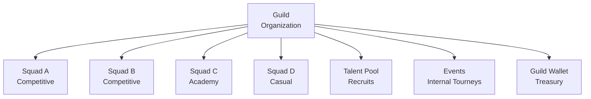

# Guilds & Communities

A **Guild** is a larger esports organization that houses multiple squads, manages talent pipelines, and operates as a professional entity within the FortisArena ecosystem.

## What is a Guild?

Think of a Guild as:
- **Esports Organization** - Multiple teams under one banner
- **Community Hub** - Training ground for players
- **Business Entity** - Revenue generation and sponsorships
- **Talent Pipeline** - Scouting and development system

## Guild vs Squad

| Feature | Squad | Guild |
|:--------|:------|:------|
| **Size** | 5-7 players | 30-500 members |
| **Scope** | Single team | Multiple teams |
| **Purpose** | Compete | Build ecosystem |
| **Revenue** | Prize splits | Multiple streams |
| **Hierarchy** | Flat | Organization structure |
| **Cost** | Free/Premium | Paid tiers |

## Guild Features

### Community Features

| Feature | Description |
|:--------|:------------|
| **Discussion Forums** | Guild-specific channels |
| **Announcement Board** | News and updates |
| **Event Calendar** | Scheduled scrims and events |
| **Resource Library** | Guides, strategies, VODs |
| **Recruitment Board** | Open positions |

### Competitive Features

| Feature | Description |
|:--------|:------------|
| **Multiple Squads** | House several teams |
| **Internal Tournaments** | Guild-only competitions |
| **Scrim Scheduling** | Organized practice |
| **Guild Leaderboard** | Rank vs other guilds |
| **Academy System** | Train new talent |

### Business Features

| Feature | Description |
|:--------|:------------|
| **Guild Wallet** | Shared treasury |
| **Revenue Sharing** | Split earnings |
| **Sponsorship Tools** | Manage deals |
| **Analytics Dashboard** | Performance metrics |
| **Brand Management** | Custom branding |

## Creating a Guild

### Requirements

- ✅ Verified Player status
- ✅ Minimum Career Level: Semi-Pro
- ✅ Or: Organization verification
- ✅ Initial membership fee

### Membership Tiers

| Tier | Members | Monthly Cost | Features |
|:-----|:--------|:-------------|:---------|
| **Starter** | 30 | $0 | Basic guild features |
| **Growth** | 35 | $10 | +5 slots, analytics |
| **Pro** | 50 | $25 | +20 slots, branding |
| **Elite** | 100 | $50 | +50 slots, API |
| **Enterprise** | 500 | $200 | Unlimited power |

*Additional slots: $10 per +5 members*

### Setup Process

<Steps>
  <Step title="Apply for Guild">
    Tournament Hub → Guilds → Create Guild
  </Step>
  
  <Step title="Choose Tier">
    Select membership tier
    Pay initial fee
  </Step>
  
  <Step title="Configure Guild">
    - Name and tag
    - Description
    - Rules and guidelines
    - Logo and branding
  </Step>
  
  <Step title="Invite Squads">
    Existing squads can join
    Or create new squads under guild
  </Step>
  
  <Step title="Launch">
    Guild goes live
    Start building community
  </Step>
</Steps>

## Guild Structure

### Leadership Hierarchy

| Role | Responsibilities |
|:-----|:-----------------|
| **Guild Master** | Overall leadership, strategy |
| **Officers** | Day-to-day management |
| **Squad Leaders** | Individual team management |
| **Coaches** | Training and development |
| **Analysts** | Performance review |
| **Members** | Players and recruits |

### Squad Integration

Squads within a guild:
- Share guild resources
- Compete in guild events
- Represent guild brand
- Contribute to guild wallet
- Follow guild standards

## Guild Wallet & Economy

### Guild Wallet

Central treasury for guild activities:
- Tournament entry fees
- Premium subscriptions
- Event hosting costs
- Member incentives
- Marketing expenses

### Revenue Sources

| Source | Description |
|:-------|:------------|
| **Tournament Winnings** | Squad prizes |
| **Sponsorships** | Brand deals |
| **Content Revenue** | Streaming, videos |
| **Internal Events** | Entry fees |
| **Merchandise** | Guild merch sales |

### Revenue Sharing

Configurable split between:
- Guild treasury (operations)
- Squad members (players)
- Content creators (streamers)
- Guild leadership

Typical split: 30% guild / 70% members

## Guild Events

### Internal Tournaments

- Guild-only competitions
- Prize pools from guild wallet
- Skill development focus
- Recruitment opportunities

### Scrimmage Leagues

- Regular practice matches
- Other guilds or internal
- Stats tracked
- Improvement focus

### Training Programs

- Academy system
- Coaching sessions
- VOD reviews
- Skill workshops

## Guild Rankings

### Leaderboards

| Type | Based On |
|:-----|:---------|
| **Guild Power** | Total members + activity |
| **Tournament Success** | Wins and placements |
| **Economic Power** | Treasury size |
| **Community** | Engagement metrics |

### Benefits of High Rank

- Featured placement
- Sponsorship opportunities
- Priority support
- Beta access
- Partnership eligibility

## Joining a Guild

### For Squads

Existing squads can apply to join guilds:
- Meet guild requirements
- Accept guild rules
- Integrate into structure
- Contribute to community

### For Individual Players

- Join guild's talent pool
- Try out for academy squads
- Progress to competitive squads
- Build reputation within guild

### Guild Applications

What guilds look for:
- Active players
- Positive attitude
- Skill potential
- Commitment level
- Teamwork ability

## Best Practices

### For Guild Masters

- Set clear vision and goals
- Build strong leadership team
- Maintain transparent finances
- Foster positive culture
- Communicate regularly

### For Members

- Represent guild professionally
- Contribute to community
- Improve skills continuously
- Support fellow members
- Follow guild guidelines

## FAQ

**Can a squad be in multiple guilds?**
No, one guild per squad.

**Can I switch guilds?**
Yes, with squad leader approval and guild rules.

**What happens if guild subscription lapses?**
Grace period, then downgrade to free tier (30 members max).

**Do guilds get verified status?**
Yes, top guilds receive verified checkmark.

**Can individuals join without a squad?**
Yes, as talent pool members or academy recruits.

## Next Steps

- [Create Your Guild](https://app.fortisarena.io/guilds/create)
- [Browse Guilds](https://app.fortisarena.io/guilds)
- [Join as Organization](/tournaments/verification)
- [Guild Management Guide](https://help.fortisarena.io/guilds)
