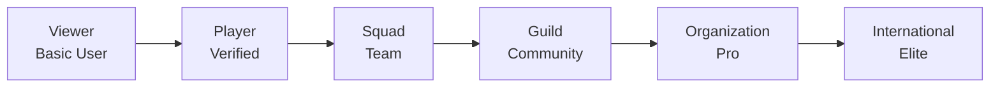
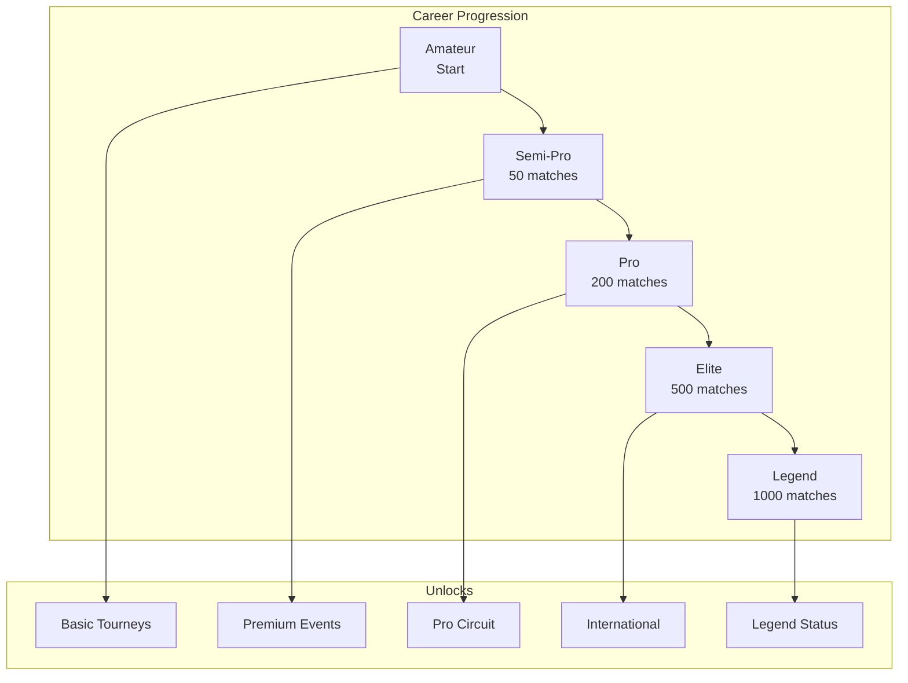

# Tournament Hub Overview

The **Tournament Hub** is FortisArena's professional esports ecosystem designed to take players from casual viewers to international competitors. Unlike the social platform's rank system, the Tournament Hub operates on a **career progression model** with real competitive integrity.

## 🎯 Core Philosophy

> **"From Viewer → Player → Pro → Organization → International Stage"**



## 👥 Three-Layer User System

The Tournament Hub uses a **verification-based access model** separate from the social platform ranks:

### 1. 👀 Basic Users (Viewers / Supporters)

**Requirements:** None (No KYC required)

**Can Do:**
- ✅ Watch live matches
- ✅ View scoreboards & stats
- ✅ See match timeline
- ✅ POV / analysis comments
- ✅ Support players & teams
- ✅ Predict winners (points only, no monetary rewards)

**Cannot Do:**
- ❌ Participate in tournaments
- ❌ Earn money/prizes
- ❌ Join squads
- ❌ Join guilds

**Role:** Audience + growth engine

---

### 2. 🎮 Verified Players (KYC Required)

**Requirements:** Complete KYC verification

**Can Do:**
- ✅ Participate in all tournament types:
  - Online tournaments
  - LAN qualifiers
  - Professional matches
- ✅ Receive wallet rewards (FRT/FPT tokens)
- ✅ Showcase player profile
- ✅ Auto-generated stats tracking
- ✅ Apply to squads
- ✅ Create/join squads
- ✅ Join guilds
- ✅ Post gameplay content

**Player Profile Includes:**
| Stat | Description |
|:-----|:------------|
| Games Played | Total competitive matches |
| Rank History | Career progression over time |
| K/D Ratio | Kill/death statistics |
| Win Rate | Percentage of matches won |
| Role | IGL, Support, Entry, etc. |
| Availability | Free / In Team / Looking |
| Career Level | Amateur → Legend |

**Role:** Real esports backbone

---

### 3. 🏢 Organizations (Power Users)

**Requirements:** Verified entity + platform approval

**Can Do:**
- ✅ Host tournaments
- ✅ Create leagues
- ✅ Run online & LAN events
- ✅ Scout players
- ✅ Create verified teams
- ✅ Manage prize pools
- ✅ Monetize events
- ✅ Handle sponsor deals
- ✅ Create official guilds
- ✅ Run academies

**Role:** Ecosystem builders

## 🎮 Match & Tournament Types

### Match Types

| Type | Description | Access |
|:-----|:------------|:-------|
| **Quick Match** | Casual ranked practice | Verified Players |
| **Scrims** | Practice matches between teams | Squad members |
| **Online Tournaments** | Weekly/monthly competitions | Verified Players |
| **LAN Qualifiers** | Region-based offline qualifiers | Verified Players |
| **Pro Circuit** | Invitation-only professional | Pro+ Career Level |
| **International** | Elite global championships | Elite+ Career Level |

### Tournament Formats

| Format | Best For | Description |
|:-------|:---------|:------------|
| **Single Elimination** | Large tournaments | Lose once = eliminated |
| **Double Elimination** | Competitive events | Winners + Losers bracket |
| **Swiss System** | Large fields | Paired by similar records |
| **League Format** | Season-long | Round robin, points based |
| **Custom** | Org events | Organization-defined rules |

## 🏅 Career Progression System

### Player Levels

Your career level is based on performance metrics:

| Level | Requirements | Unlock |
|:------|:-------------|:-------|
| **Amateur** | Start here | Basic tournaments |
| **Semi-Pro** | 50+ matches, 45%+ win rate | Premium tournaments |
| **Pro** | 200+ matches, 50%+ win rate, Tier 2+ wins | Pro Circuit invites |
| **Elite** | 500+ matches, 55%+ win rate, Tier 1 wins | International events |
| **Legend** | 1000+ matches, 60%+ win rate, Major championships | Legend status, exclusive events |

### Progression Metrics

Career level is calculated from:

- **Matches Played** - Total competitive games
- **Win Ratio** - Percentage of victories
- **Tournament Tier** - Higher tier = more weight
- **Opponent Level** - Beating higher-ranked players boosts progression
- **Consistency** - Regular participation bonuses



## 🛡️ Squad System (Team Level)

### What is a Squad?

A **Squad** is a competitive team of 5-7 players (depending on game) that competes together in tournaments.

### Squad Features

| Feature | Description |
|:--------|:------------|
| **Public/Private** | Open recruitment or invite-only |
| **Player Count** | 5-7 players (game dependent) |
| **Leaderboard** | Squad ranking vs other squads |
| **Match History** | Record of all squad matches |
| **Roles** | IGL, Support, Entry, etc. |
| **Trial Slots** | Temporary spots for tryouts |
| **Recruitment** | Open/closed to new applicants |

### Creating a Squad

**Requirements:**
- Must be a Verified Player
- Minimum Career Level: Amateur

**Cost:**
- **Free:** Basic squad features
- **Premium:** Branding, analytics, custom URL

### Squad Management

Squad leaders can:
- Set recruitment status
- Assign roles
- Schedule scrims
- Apply to guilds
- Manage roster

## 🏰 Guild System (Community + Power)

### What is a Guild?

A **Guild** is a larger community organization that can house multiple squads, run internal events, and build a talent pipeline.

### Guild Features

| Feature | Description |
|:--------|:------------|
| **Community Hub** | Discussion forums, announcements |
| **Practice Hub** | Scheduled scrims, training |
| **Talent Pool** | Scouting and development |
| **Internal Events** | Guild-only tournaments |
| **Guild Wallet** | Shared treasury for guild activities |
| **Revenue Sharing** | Split earnings from guild events |
| **Multiple Squads** | House several teams under one guild |

### Guild Membership Tiers

| Tier | Members | Cost | Features |
|:-----|:--------|:-----|:---------|
| **Free** | 30 members | $0 | Basic guild features |
| **Standard** | 35 members | $10 | +5 slots, analytics |
| **Premium** | 50 members | $25 | Custom branding, priority support |
| **Elite** | 100 members | $50 | Full features, early access |
| **Max** | 500 members | $200 | Unlimited power |

*Note: $10 → +5 slots means each $10 purchase adds 5 member slots*

### Guild Powers

Guild leaders can:
- Host internal tournaments
- View guild leaderboard
- Manage guild wallet
- Set revenue sharing %
- Scout and recruit players
- Partner with organizations

## 💰 Wallet & Rewards

### Internal Wallet System

FortisArena provides an **internal wallet** (not external like MetaMask):

- **Platform-managed** - Secure, user-friendly
- **Instant transactions** - No gas fees for internal transfers
- **Auto-payout** - Tournament winnings deposited automatically
- **Withdrawal option** - Convert to external crypto when needed

### Earning Sources

| Source | Description | Paid In |
|:-------|:------------|:--------|
| **Tournament Prize Pools** | Winnings from competitions | FRT/FPT |
| **Performance Bonuses** | MVP, top frag, etc. | FRT/FPT |
| **Guild Earnings** | Revenue share from guild | FRT/FPT |
| **Creator Tips** | Viewer donations (future) | FRT |
| **Sponsorships** | Org deals (Organizations only) | Fiat/FRT |

### Payout Structure

| Tournament Tier | Prize Range | Distribution |
|:----------------|:------------|:-------------|
| **Quick Match** | 100-500 FPT | Top 3 |
| **Online Weekly** | 1,000-5,000 FRT | Top 8 |
| **Monthly Major** | 10,000-50,000 FRT | Top 16 |
| **LAN Qualifier** | 25,000-100,000 FRT | Top 8 |
| **Pro Circuit** | 100,000+ FRT | Custom |
| **International** | 500,000+ FRT | Custom |

## 🎥 Creator & Streaming (Future Layer)

### Creator Mode

**Requirements:** Invite-only or Rank 4 (Authority) on social platform

**Can Do:**
- Stream tournament matches
- Create highlight clips
- Tournament casting/commentary
- POV player streams
- Earn via tips & subscriptions

**Restrictions:**
- 🚫 Random streaming not allowed
- ✅ Only verified creators/players can stream
- ✅ Content must be tournament-related

## 🔐 Anti-Cheat & Trust System

### Security Measures

| Layer | Implementation |
|:------|:---------------|
| **KYC Verification** | Identity check for all players |
| **Device Fingerprinting** | Unique device identification |
| **Match Review** | AI + human review system |
| **Admin Moderation** | 24/7 oversight |
| **Dispute Resolution** | Panel for contested matches |
| **Blockchain Recording** | Final results stored on-chain |

### Data Storage Strategy

To minimize gas fees while maintaining integrity:

```
Live Match → Database (Fast, cheap)
    ↓
Match Ends → Verification (AI + Admin)
    ↓
Final Results → Blockchain (Permanent, verifiable)
```

**What Gets Stored Where:**

| Data | Storage | Reason |
|:-----|:--------|:-------|
| Live scores | Database | Speed, real-time |
| Player stats | Database | Frequent updates |
| Match replays | IPFS/Database | Large files |
| **Final results** | **Blockchain** | **Immutable proof** |
| **Prize distribution** | **Blockchain** | **Transparent** |
| Career records | Database + Blockchain | Hybrid approach |

## 🚀 Getting Started in Tournament Hub

### Path 1: Player Journey

<Steps>
  <Step title="Create Account">
    Sign up on FortisArena platform
  </Step>
  
  <Step title="Complete KYC">
    Verify identity to become Verified Player
    (Required for tournament participation)
  </Step>
  
  <Step title="Build Profile">
    Set up player profile
    Select your games and roles
  </Step>
  
  <Step title="Start Competing">
    Join Quick Matches
    Participate in Online Tournaments
  </Step>
  
  <Step title="Join/Create Squad">
    Find teammates
    Form competitive team
  </Step>
  
  <Step title="Career Progression">
    Climb from Amateur to Legend
    Unlock premium tournaments
  </Step>
</Steps>

### Path 2: Organization Journey

<Steps>
  <Step title="Apply for Organization Status">
    Submit business verification
    Provide tournament hosting history
  </Step>
  
  <Step title="Platform Approval">
    Review by FortisArena team
    Agreement on terms
  </Step>
  
  <Step title="Create Guild">
    Set up community hub
    Invite initial squads
  </Step>
  
  <Step title="Host Events">
    Run tournaments
    Build reputation
  </Step>
  
  <Step title="Monetize">
    Sponsorship deals
-    Revenue from events
  </Step>
</Steps>

## 📊 Tournament Hub vs Social Platform

| Feature | Social Platform | Tournament Hub |
|:--------|:----------------|:---------------|
| **Access** | Rank-based (0-4) | Verification-based |
| **KYC Required** | No | Yes (for players) |
| **Focus** | Content creation | Competitive gaming |
| **Progression** | Points → Ranks | Career Levels |
| **Earning** | Points, Revenue share (Rank 4) | Tournament prizes, Guild earnings |
| **Monetization** | Creator economy | Esports prizes, Org revenue |
| **Wallet** | Internal | Internal + External withdrawal |
| **Data Storage** | Database | DB + Blockchain (final results) |

## 🎮 Supported Games

Current and planned game integrations:

| Genre | Games | Status |
|:------|:------|:-------|
| **Battle Royale** | PUBG, Free Fire | Live |
| **FPS** | CS:GO, Valorant | Live |
| **MOBA** | Dota 2, League of Legends | Coming Soon |
| **Sports** | FIFA, eFootball | Coming Soon |
| **Strategy** | StarCraft II | Planned |
| **Fighting** | Street Fighter, Tekken | Planned |

## 📞 Support & Resources

**For Players:**
- Tournament support: tournaments@fortisarena.io
- Anti-cheat reports: ac@fortisarena.io
- Squad management: squads@fortisarena.io

**For Organizations:**
- Partnership inquiries: orgs@fortisarena.io
- Event hosting: events@fortisarena.io

## 🎯 Next Steps

<CardGroup cols={2}>
  <Card title="Verify Your Account" icon="shield-check" href="/tournaments/verification">
    Complete KYC to start competing
  </Card>
  <Card title="Join a Squad" icon="users" href="/tournaments/squads">
    Find teammates and start competing
  </Card>
  <Card title="Browse Tournaments" icon="trophy" href="https://app.fortisarena.io/tournaments">
    Find upcoming competitions
  </Card>
  <Card title="Create Guild" icon="home" href="/tournaments/guilds">
    Build your esports organization
  </Card>
</CardGroup>

<Note>
  The Tournament Hub is separate from the social platform's rank system. You can be Rank 0 on social but a Pro player in tournaments, or vice versa. Both systems complement each other to create a complete esports ecosystem.
</Note>

---

> **Tournament Hub** - Where Casual Becomes Competitive, and Competitive Becomes Professional.
